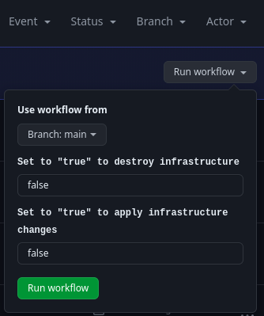
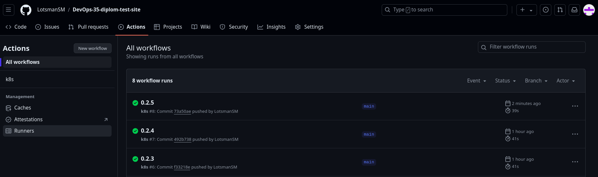

# Автор: Лоцман Сергей Михайлович DEVOPS-35

# Дипломный практикум в Yandex.Cloud
  * [Цели:](#цели)
  * [Этапы выполнения:](#этапы-выполнения)
     * [Создание облачной инфраструктуры](#создание-облачной-инфраструктуры)
     * [Создание Kubernetes кластера](#создание-kubernetes-кластера)
     * [Создание тестового приложения](#создание-тестового-приложения)
     * [Подготовка cистемы мониторинга и деплой приложения](#подготовка-cистемы-мониторинга-и-деплой-приложения)
     * [Установка и настройка CI/CD](#установка-и-настройка-cicd)
  * [Что необходимо для сдачи задания?](#что-необходимо-для-сдачи-задания)
  * [Как правильно задавать вопросы дипломному руководителю?](#как-правильно-задавать-вопросы-дипломному-руководителю)

**Перед началом работы над дипломным заданием изучите [Инструкция по экономии облачных ресурсов](https://github.com/netology-code/devops-materials/blob/master/cloudwork.MD).**

---
## Цели:

1. Подготовить облачную инфраструктуру на базе облачного провайдера Яндекс.Облако.
2. Запустить и сконфигурировать Kubernetes кластер.
3. Установить и настроить систему мониторинга.
4. Настроить и автоматизировать сборку тестового приложения с использованием Docker-контейнеров.
5. Настроить CI для автоматической сборки и тестирования.
6. Настроить CD для автоматического развёртывания приложения.

---
## Этапы выполнения:


### Создание облачной инфраструктуры

Для начала необходимо подготовить облачную инфраструктуру в ЯО при помощи [Terraform](https://www.terraform.io/).

Особенности выполнения:

- Бюджет купона ограничен, что следует иметь в виду при проектировании инфраструктуры и использовании ресурсов;
Для облачного k8s используйте региональный мастер(неотказоустойчивый). Для self-hosted k8s минимизируйте ресурсы ВМ и долю ЦПУ. В обоих вариантах используйте прерываемые ВМ для worker nodes.

Предварительная подготовка к установке и запуску Kubernetes кластера.

1. Создайте сервисный аккаунт, который будет в дальнейшем использоваться Terraform для работы с инфраструктурой с необходимыми и достаточными правами. Не стоит использовать права суперпользователя
2. Подготовьте [backend](https://www.terraform.io/docs/language/settings/backends/index.html) для Terraform:  
   а. Рекомендуемый вариант: S3 bucket в созданном ЯО аккаунте(создание бакета через TF)
   б. Альтернативный вариант:  [Terraform Cloud](https://app.terraform.io/)  
3. Создайте VPC с подсетями в разных зонах доступности.
4. Убедитесь, что теперь вы можете выполнить команды `terraform destroy` и `terraform apply` без дополнительных ручных действий.
5. В случае использования [Terraform Cloud](https://app.terraform.io/) в качестве [backend](https://www.terraform.io/docs/language/settings/backends/index.html) убедитесь, что применение изменений успешно проходит, используя web-интерфейс Terraform cloud.

Ожидаемые результаты:

1. Terraform сконфигурирован и создание инфраструктуры посредством Terraform возможно без дополнительных ручных действий.
2. Полученная конфигурация инфраструктуры является предварительной, поэтому в ходе дальнейшего выполнения задания возможны изменения.

### Выполнение этапа "Создание облачной инфраструктуры":

1. Создам сервисный аккаунт с необходимыми правами для работы с облачной инфраструктурой:

```
# Создаем сервисный аккаунт для Terraform
resource "yandex_iam_service_account" "service" {
  folder_id = var.folder_id
  name      = var.account_name
}

# Выдаем роль editor сервисному аккаунту Terraform
resource "yandex_resourcemanager_folder_iam_member" "service_editor" {
  folder_id = var.folder_id
  role      = "editor"
  member    = "serviceAccount:${yandex_iam_service_account.service.id}"
}
```

2. Подготавливаю backend для Terraform. Использовать буду S3-bucket:

```
# Создаем статический ключ доступа для сервисного аккаунта
resource "yandex_iam_service_account_static_access_key" "terraform_service_account_key" {
  service_account_id = yandex_iam_service_account.service.id
}

# Используем ключ доступа для создания бакета
resource "yandex_storage_bucket" "tf-bucket" {
  bucket     = "lsm-diplom-bucket"
  max_size   = 1073741824
  access_key = yandex_iam_service_account_static_access_key.terraform_service_account_key.access_key
  secret_key = yandex_iam_service_account_static_access_key.terraform_service_account_key.secret_key

  anonymous_access_flags {
    read = false
    list = false
  }

  force_destroy = true

provisioner "local-exec" {
  command = "echo export ACCESS_KEY=${yandex_iam_service_account_static_access_key.terraform_service_account_key.access_key} > ../terraform/backend.tfvars"
}

provisioner "local-exec" {
  command = "echo export SECRET_KEY=${yandex_iam_service_account_static_access_key.terraform_service_account_key.secret_key} >> ../terraform/backend.tfvars"
}
}
```

Инициализирую проект:

```bash
╰─➤terraform init

Initializing the backend...

Initializing provider plugins...
- Finding latest version of yandex-cloud/yandex...
- Installing yandex-cloud/yandex v0.126.0...
- Installed yandex-cloud/yandex v0.126.0 (unauthenticated)

Terraform has created a lock file .terraform.lock.hcl to record the provider
selections it made above. Include this file in your version control repository
so that Terraform can guarantee to make the same selections by default when
you run "terraform init" in the future.

╷
│ Warning: Incomplete lock file information for providers
│ 
│ Due to your customized provider installation methods, Terraform was forced to calculate lock file checksums locally for the following providers:
│   - yandex-cloud/yandex
│ 
│ The current .terraform.lock.hcl file only includes checksums for linux_amd64, so Terraform running on another platform will fail to install these providers.
│ 
│ To calculate additional checksums for another platform, run:
│   terraform providers lock -platform=linux_amd64
│ (where linux_amd64 is the platform to generate)
╵

Terraform has been successfully initialized!

You may now begin working with Terraform. Try running "terraform plan" to see
any changes that are required for your infrastructure. All Terraform commands
should now work.

If you ever set or change modules or backend configuration for Terraform,
rerun this command to reinitialize your working directory. If you forget, other
commands will detect it and remind you to do so if necessary.
```

Применю код:

```bash
╰─➤terraform apply -auto-approve

Terraform used the selected providers to generate the following execution plan. Resource actions are indicated with the following symbols:
  + create

Terraform will perform the following actions:

  # yandex_iam_service_account.service will be created
  + resource "yandex_iam_service_account" "service" {
      + created_at = (known after apply)
      + folder_id  = "b1gl6dqee4o5qromajnb"
      + id         = (known after apply)
      + name       = "service"
    }

  # yandex_iam_service_account_static_access_key.terraform_service_account_key will be created
  + resource "yandex_iam_service_account_static_access_key" "terraform_service_account_key" {
      + access_key           = (known after apply)
      + created_at           = (known after apply)
      + encrypted_secret_key = (known after apply)
      + id                   = (known after apply)
      + key_fingerprint      = (known after apply)
      + secret_key           = (sensitive value)
      + service_account_id   = (known after apply)
    }

  # yandex_resourcemanager_folder_iam_member.service_editor will be created
  + resource "yandex_resourcemanager_folder_iam_member" "service_editor" {
      + folder_id = "b1gl6dqee4o5qromajnb"
      + id        = (known after apply)
      + member    = (known after apply)
      + role      = "editor"
    }

  # yandex_storage_bucket.tf-bucket will be created
  + resource "yandex_storage_bucket" "tf-bucket" {
      + access_key            = (known after apply)
      + bucket                = "lsm-diplom-bucket"
      + bucket_domain_name    = (known after apply)
      + default_storage_class = (known after apply)
      + folder_id             = (known after apply)
      + force_destroy         = true
      + id                    = (known after apply)
      + max_size              = 1073741824
      + secret_key            = (sensitive value)
      + website_domain        = (known after apply)
      + website_endpoint      = (known after apply)

      + anonymous_access_flags {
          + list = false
          + read = false
        }
    }

Plan: 4 to add, 0 to change, 0 to destroy.
yandex_iam_service_account.service: Creating...
yandex_iam_service_account.service: Creation complete after 3s [id=aje7cftietvodb39sfn9]
yandex_resourcemanager_folder_iam_member.service_editor: Creating...
yandex_iam_service_account_static_access_key.terraform_service_account_key: Creating...
yandex_iam_service_account_static_access_key.terraform_service_account_key: Creation complete after 2s [id=ajekmuv72g6k56r4kk47]
yandex_storage_bucket.tf-bucket: Creating...
yandex_resourcemanager_folder_iam_member.service_editor: Creation complete after 4s [id=b1gl6dqee4o5qromajnb/editor/serviceAccount:aje7cftietvodb39sfn9]
yandex_storage_bucket.tf-bucket: Provisioning with 'local-exec'...
yandex_storage_bucket.tf-bucket (local-exec): Executing: ["/bin/sh" "-c" "echo export AWS_ACCESS_KEY=YCAJEEzR7VH5QJ8PNDhFcsxuD > ../terraform/backend.tfvars"]
yandex_storage_bucket.tf-bucket: Provisioning with 'local-exec'...
yandex_storage_bucket.tf-bucket (local-exec): (output suppressed due to sensitive value in config)
yandex_storage_bucket.tf-bucket: Creation complete after 5s [id=lsm-diplom-bucket]

Apply complete! Resources: 4 added, 0 changed, 0 destroyed.
```

В результате применения этого кода Terraform был создан сервисный аккаунт с правами для редактирования, статический ключ доступа и S3-bucket. Переменные `AWS_ACCESS_KEY` и `AWS_SECRET_KEY` будут записаны в файл `backend.tfvars`. Сделано так потому, что эти данные являются очень чувствительными и не рекомендуется их хранить в облаке. Эти переменные будут в экспортированы в оболочку рабочего окружения.

Проверю, создался ли S3-bucket и сервисный аккаунт:

```bash
╰─➤yc iam service-account list
+----------------------+---------+--------+
|          ID          |  NAME   | LABELS |
+----------------------+---------+--------+
| aje7cftietvodb39sfn9 | service |        |
+----------------------+---------+--------+


╰─➤yc storage bucket list
+-------------------+----------------------+------------+-----------------------+---------------------+
|       NAME        |      FOLDER ID       |  MAX SIZE  | DEFAULT STORAGE CLASS |     CREATED AT      |
+-------------------+----------------------+------------+-----------------------+---------------------+
| lsm-diplom-bucket | b1gl6dqee4o5qromajnb | 1073741824 | STANDARD              | 2024-08-11 16:38:28 |
+-------------------+----------------------+------------+-----------------------+---------------------+
```

Сервисный аккаунт и S3-bucket созданы.

После создания S3-bucket, выполню настройку для его использования в качестве backend для Terraform. Для этого пишу следующий код:

```
terraform {
  backend "s3" {
    endpoint = "storage.yandexcloud.net"
    bucket = "lsm-diplom-bucket"
    region = "ru-central1"
    key = "lsm-diplom-bucket/terraform.tfstate"
    skip_region_validation = true
    skip_credentials_validation = true
  }
}
```
Этот код настраивает Terraform на использование Yandex Cloud Storage в качестве места для хранения файла состояния `terraform.tfstate`, который содержит информацию о конфигурации и состоянии управляемых Terraform ресурсов. Чтобы код был корректно применен и Terraform успешно инициализировался, задам параметры для доступа к S3 хранилищу. Как писал выше, делать это я буду с помощью переменных окружения:

```bash
╰─➤export AWS_SECRET_KEY=YCM_9O3E5WFT8j1EbrFmRRJ1v_ibezi56MSZu7ce

╰─➤export AWS_ACCESS_KEY=YCAJEEzR7VH5QJ8PNDhFcsxuD
```

3. Создаю VPC с подсетями в разных зонах доступности:

```
resource "yandex_vpc_network" "diplom" {
  name = var.vpc_name
}
resource "yandex_vpc_subnet" "diplom-subnet1" {
  name           = var.subnet1
  zone           = var.zone1
  network_id     = yandex_vpc_network.diplom.id
  v4_cidr_blocks = var.cidr1
}

resource "yandex_vpc_subnet" "diplom-subnet2" {
  name           = var.subnet2
  zone           = var.zone2
  network_id     = yandex_vpc_network.diplom.id
  v4_cidr_blocks = var.cidr2
}

variable "zone1" {
  type        = string
  default     = "ru-central1-a"
  description = "https://cloud.yandex.ru/docs/overview/concepts/geo-scope"
}

variable "zone2" {
  type        = string
  default     = "ru-central1-b"
  description = "https://cloud.yandex.ru/docs/overview/concepts/geo-scope"
}

variable "cidr1" {
  type        = list(string)
  default     = ["10.0.1.0/24"]
  description = "https://cloud.yandex.ru/docs/vpc/operations/subnet-create"
}

variable "cidr2" {
  type        = list(string)
  default     = ["10.0.2.0/24"]
  description = "https://cloud.yandex.ru/docs/vpc/operations/subnet-create"
}

variable "vpc_name" {
  type        = string
  default     = "diplom"
  description = "VPC network&subnet name"
}

variable "bucket_name" {
  type        = string
  default     = "ft-state"
  description = "VPC network&subnet name"
}

variable "subnet1" {
  type        = string
  default     = "diplom-subnet1"
  description = "subnet name"
}

variable "subnet2" {
  type        = string
  default     = "diplom-subnet2"
  description = "subnet name"
}
```

4. Описываю код Terraform для создания виртуальных машин для Kubernetes кластера. Буду использовать одну Master ноду и две Worker ноды.

Инициализирую Terraform:

```bash
╰─➤terraform init

Initializing the backend...

Successfully configured the backend "s3"! Terraform will automatically
use this backend unless the backend configuration changes.

Initializing provider plugins...
- Finding latest version of hashicorp/template...
- Finding latest version of yandex-cloud/yandex...
- Finding latest version of hashicorp/local...
- Installing hashicorp/template v2.2.0...
- Installed hashicorp/template v2.2.0 (unauthenticated)
- Installing yandex-cloud/yandex v0.126.0...
- Installed yandex-cloud/yandex v0.126.0 (unauthenticated)
- Installing hashicorp/local v2.5.1...
- Installed hashicorp/local v2.5.1 (unauthenticated)

Terraform has created a lock file .terraform.lock.hcl to record the provider
selections it made above. Include this file in your version control repository
so that Terraform can guarantee to make the same selections by default when
you run "terraform init" in the future.

╷
│ Warning: Incomplete lock file information for providers
│ 
│ Due to your customized provider installation methods, Terraform was forced to calculate lock file checksums locally for the following providers:
│   - hashicorp/local
│   - hashicorp/template
│   - yandex-cloud/yandex
│ 
│ The current .terraform.lock.hcl file only includes checksums for linux_amd64, so Terraform running on another platform will fail to install these providers.
│ 
│ To calculate additional checksums for another platform, run:
│   terraform providers lock -platform=linux_amd64
│ (where linux_amd64 is the platform to generate)
╵

Terraform has been successfully initialized!

You may now begin working with Terraform. Try running "terraform plan" to see
any changes that are required for your infrastructure. All Terraform commands
should now work.

If you ever set or change modules or backend configuration for Terraform,
rerun this command to reinitialize your working directory. If you forget, other
commands will detect it and remind you to do so if necessary.
```

Видно, что Terraform успешно инициализирован, backend с типом s3 успешно настроен. Terraform будет использовать этот backend для хранения файла состояния `terraform.tfstate`.

Для проверки правильности кода, можно использовать команды `terraform validate` и `terraform plan`. В моём коде ошибок не обнаружено:

```bash
╰─➤terraform validate 
Success! The configuration is valid.
```

Применю код для создания облачной инфраструктуры, состоящей из одной Master ноды, двух Worker нод, сети и подсети:

```bash
╰─➤terraform apply -auto-approve
data.template_file.cloudinit: Reading...
data.template_file.cloudinit: Read complete after 0s [id=f95b9145823e7854baf57a6dcb4d770613300f5382900a7a1abd3831abed7c6b]
data.yandex_compute_image.ubuntu-master: Reading...
data.yandex_compute_image.ubuntu-worker: Reading...
data.yandex_compute_image.ubuntu-worker: Read complete after 0s [id=fd8ue2nph2v23d0rtfug]
data.yandex_compute_image.ubuntu-master: Read complete after 0s [id=fd8ue2nph2v23d0rtfug]

Terraform used the selected providers to generate the following execution plan. Resource actions are indicated with the following symbols:
  + create

Terraform will perform the following actions:

  # local_file.hosts_cfg_kubespray[0] will be created
  + resource "local_file" "hosts_cfg_kubespray" {
      + content              = (known after apply)
      + content_base64sha256 = (known after apply)
      + content_base64sha512 = (known after apply)
      + content_md5          = (known after apply)
      + content_sha1         = (known after apply)
      + content_sha256       = (known after apply)
      + content_sha512       = (known after apply)
      + directory_permission = "0777"
      + file_permission      = "0777"
      + filename             = "../../kubespray/inventory/mycluster/hosts.yaml"
      + id                   = (known after apply)
    }

  # yandex_compute_instance.master[0] will be created
  + resource "yandex_compute_instance" "master" {
      + allow_stopping_for_update = true
      + created_at                = (known after apply)
      + folder_id                 = (known after apply)
      + fqdn                      = (known after apply)
      + gpu_cluster_id            = (known after apply)
      + hostname                  = (known after apply)
      + id                        = (known after apply)
      + maintenance_grace_period  = (known after apply)
      + maintenance_policy        = (known after apply)
      + metadata                  = {
          + "serial-port-enable" = "1"
          + "ssh-keys"           = <<-EOT
                ubuntu:ssh-ed25519 AAAAC3NzaC1lZDI1NTE5AAAAIBl5/crtWIqG261tg/WA/bbDS3XWFJS8McPXaHDnrP6S LotsmanSM@mail.ru
            EOT
          + "user-data"          = <<-EOT
                #cloud-config
                users:
                  - name: ubuntu
                    groups: sudo
                    shell: /bin/bash
                    sudo: ['ALL=(ALL) NOPASSWD:ALL']
                    ssh_authorized_keys:
                      - ssh-ed25519 AAAAC3NzaC1lZDI1NTE5AAAAIBl5/crtWIqG261tg/WA/bbDS3XWFJS8McPXaHDnrP6S LotsmanSM@mail.ru
                
                package_update: true
                package_upgrade: false
                packages:
                  - mc
                  - git
                  - apt-transport-https
                  - ca-certificates
                  - curl
                  - gnupg
                  - lsb-release
                  - unattended-upgrades
                
                runcmd:
                  - curl -fsSL -o get_helm.sh https://raw.githubusercontent.com/helm/helm/main/scripts/get-helm-3
                  - chmod 700 get_helm.sh
                  - ./get_helm.sh
            EOT
        }
      + name                      = "master"
      + network_acceleration_type = "standard"
      + platform_id               = "standard-v1"
      + service_account_id        = (known after apply)
      + status                    = (known after apply)
      + zone                      = "ru-central1-a"

      + boot_disk {
          + auto_delete = true
          + device_name = (known after apply)
          + disk_id     = (known after apply)
          + mode        = (known after apply)

          + initialize_params {
              + block_size  = (known after apply)
              + description = (known after apply)
              + image_id    = "fd8ue2nph2v23d0rtfug"
              + name        = (known after apply)
              + size        = 10
              + snapshot_id = (known after apply)
              + type        = "network-hdd"
            }
        }

      + network_interface {
          + index              = (known after apply)
          + ip_address         = (known after apply)
          + ipv4               = true
          + ipv6               = (known after apply)
          + ipv6_address       = (known after apply)
          + mac_address        = (known after apply)
          + nat                = true
          + nat_ip_address     = (known after apply)
          + nat_ip_version     = (known after apply)
          + security_group_ids = (known after apply)
          + subnet_id          = (known after apply)
        }

      + resources {
          + core_fraction = 5
          + cores         = 2
          + memory        = 4
        }

      + scheduling_policy {
          + preemptible = true
        }
    }

  # yandex_compute_instance.worker[0] will be created
  + resource "yandex_compute_instance" "worker" {
      + allow_stopping_for_update = true
      + created_at                = (known after apply)
      + folder_id                 = (known after apply)
      + fqdn                      = (known after apply)
      + gpu_cluster_id            = (known after apply)
      + hostname                  = (known after apply)
      + id                        = (known after apply)
      + maintenance_grace_period  = (known after apply)
      + maintenance_policy        = (known after apply)
      + metadata                  = {
          + "serial-port-enable" = "1"
          + "ssh-keys"           = <<-EOT
                ubuntu:ssh-ed25519 AAAAC3NzaC1lZDI1NTE5AAAAIBl5/crtWIqG261tg/WA/bbDS3XWFJS8McPXaHDnrP6S LotsmanSM@mail.ru
            EOT
          + "user-data"          = <<-EOT
                #cloud-config
                users:
                  - name: ubuntu
                    groups: sudo
                    shell: /bin/bash
                    sudo: ['ALL=(ALL) NOPASSWD:ALL']
                    ssh_authorized_keys:
                      - ssh-ed25519 AAAAC3NzaC1lZDI1NTE5AAAAIBl5/crtWIqG261tg/WA/bbDS3XWFJS8McPXaHDnrP6S LotsmanSM@mail.ru
                
                package_update: true
                package_upgrade: false
                packages:
                  - mc
                  - git
                  - apt-transport-https
                  - ca-certificates
                  - curl
                  - gnupg
                  - lsb-release
                  - unattended-upgrades
                
                runcmd:
                  - curl -fsSL -o get_helm.sh https://raw.githubusercontent.com/helm/helm/main/scripts/get-helm-3
                  - chmod 700 get_helm.sh
                  - ./get_helm.sh
            EOT
        }
      + name                      = "worker-1"
      + network_acceleration_type = "standard"
      + platform_id               = "standard-v1"
      + service_account_id        = (known after apply)
      + status                    = (known after apply)
      + zone                      = "ru-central1-b"

      + boot_disk {
          + auto_delete = true
          + device_name = (known after apply)
          + disk_id     = (known after apply)
          + mode        = (known after apply)

          + initialize_params {
              + block_size  = (known after apply)
              + description = (known after apply)
              + image_id    = "fd8ue2nph2v23d0rtfug"
              + name        = (known after apply)
              + size        = 10
              + snapshot_id = (known after apply)
              + type        = "network-hdd"
            }
        }

      + network_interface {
          + index              = (known after apply)
          + ip_address         = (known after apply)
          + ipv4               = true
          + ipv6               = (known after apply)
          + ipv6_address       = (known after apply)
          + mac_address        = (known after apply)
          + nat                = true
          + nat_ip_address     = (known after apply)
          + nat_ip_version     = (known after apply)
          + security_group_ids = (known after apply)
          + subnet_id          = (known after apply)
        }

      + resources {
          + core_fraction = 100
          + cores         = 4
          + memory        = 8
        }

      + scheduling_policy {
          + preemptible = true
        }
    }

  # yandex_compute_instance.worker[1] will be created
  + resource "yandex_compute_instance" "worker" {
      + allow_stopping_for_update = true
      + created_at                = (known after apply)
      + folder_id                 = (known after apply)
      + fqdn                      = (known after apply)
      + gpu_cluster_id            = (known after apply)
      + hostname                  = (known after apply)
      + id                        = (known after apply)
      + maintenance_grace_period  = (known after apply)
      + maintenance_policy        = (known after apply)
      + metadata                  = {
          + "serial-port-enable" = "1"
          + "ssh-keys"           = <<-EOT
                ubuntu:ssh-ed25519 AAAAC3NzaC1lZDI1NTE5AAAAIBl5/crtWIqG261tg/WA/bbDS3XWFJS8McPXaHDnrP6S LotsmanSM@mail.ru
            EOT
          + "user-data"          = <<-EOT
                #cloud-config
                users:
                  - name: ubuntu
                    groups: sudo
                    shell: /bin/bash
                    sudo: ['ALL=(ALL) NOPASSWD:ALL']
                    ssh_authorized_keys:
                      - ssh-ed25519 AAAAC3NzaC1lZDI1NTE5AAAAIBl5/crtWIqG261tg/WA/bbDS3XWFJS8McPXaHDnrP6S LotsmanSM@mail.ru
                
                package_update: true
                package_upgrade: false
                packages:
                  - mc
                  - git
                  - apt-transport-https
                  - ca-certificates
                  - curl
                  - gnupg
                  - lsb-release
                  - unattended-upgrades
                
                runcmd:
                  - curl -fsSL -o get_helm.sh https://raw.githubusercontent.com/helm/helm/main/scripts/get-helm-3
                  - chmod 700 get_helm.sh
                  - ./get_helm.sh
            EOT
        }
      + name                      = "worker-2"
      + network_acceleration_type = "standard"
      + platform_id               = "standard-v1"
      + service_account_id        = (known after apply)
      + status                    = (known after apply)
      + zone                      = "ru-central1-b"

      + boot_disk {
          + auto_delete = true
          + device_name = (known after apply)
          + disk_id     = (known after apply)
          + mode        = (known after apply)

          + initialize_params {
              + block_size  = (known after apply)
              + description = (known after apply)
              + image_id    = "fd8ue2nph2v23d0rtfug"
              + name        = (known after apply)
              + size        = 10
              + snapshot_id = (known after apply)
              + type        = "network-hdd"
            }
        }

      + network_interface {
          + index              = (known after apply)
          + ip_address         = (known after apply)
          + ipv4               = true
          + ipv6               = (known after apply)
          + ipv6_address       = (known after apply)
          + mac_address        = (known after apply)
          + nat                = true
          + nat_ip_address     = (known after apply)
          + nat_ip_version     = (known after apply)
          + security_group_ids = (known after apply)
          + subnet_id          = (known after apply)
        }

      + resources {
          + core_fraction = 100
          + cores         = 4
          + memory        = 8
        }

      + scheduling_policy {
          + preemptible = true
        }
    }

  # yandex_lb_network_load_balancer.nlb-grafana will be created
  + resource "yandex_lb_network_load_balancer" "nlb-grafana" {
      + created_at          = (known after apply)
      + deletion_protection = (known after apply)
      + folder_id           = (known after apply)
      + id                  = (known after apply)
      + name                = "grafana"
      + region_id           = (known after apply)
      + type                = "external"

      + attached_target_group {
          + target_group_id = (known after apply)

          + healthcheck {
              + healthy_threshold   = 2
              + interval            = 2
              + name                = "healthcheck"
              + timeout             = 1
              + unhealthy_threshold = 2

              + tcp_options {
                  + port = 30050
                }
            }
        }

      + listener {
          + name        = "grafana-listener"
          + port        = 3000
          + protocol    = (known after apply)
          + target_port = 30050

          + external_address_spec {
              + address    = (known after apply)
              + ip_version = "ipv4"
            }
        }
    }

  # yandex_lb_network_load_balancer.nlb-web-app will be created
  + resource "yandex_lb_network_load_balancer" "nlb-web-app" {
      + created_at          = (known after apply)
      + deletion_protection = (known after apply)
      + folder_id           = (known after apply)
      + id                  = (known after apply)
      + name                = "web-app"
      + region_id           = (known after apply)
      + type                = "external"

      + attached_target_group {
          + target_group_id = (known after apply)

          + healthcheck {
              + healthy_threshold   = 2
              + interval            = 2
              + name                = "healthcheck"
              + timeout             = 1
              + unhealthy_threshold = 2

              + tcp_options {
                  + port = 30051
                }
            }
        }

      + listener {
          + name        = "web-app-listener"
          + port        = 80
          + protocol    = (known after apply)
          + target_port = 30051

          + external_address_spec {
              + address    = (known after apply)
              + ip_version = "ipv4"
            }
        }
    }

  # yandex_lb_target_group.balancer-group will be created
  + resource "yandex_lb_target_group" "balancer-group" {
      + created_at = (known after apply)
      + folder_id  = (known after apply)
      + id         = (known after apply)
      + name       = "balancer-group"
      + region_id  = (known after apply)

      + target {
          + address   = (known after apply)
          + subnet_id = (known after apply)
        }
      + target {
          + address   = (known after apply)
          + subnet_id = (known after apply)
        }
    }

  # yandex_vpc_network.diplom will be created
  + resource "yandex_vpc_network" "diplom" {
      + created_at                = (known after apply)
      + default_security_group_id = (known after apply)
      + folder_id                 = (known after apply)
      + id                        = (known after apply)
      + labels                    = (known after apply)
      + name                      = "diplom"
      + subnet_ids                = (known after apply)
    }

  # yandex_vpc_subnet.diplom-subnet1 will be created
  + resource "yandex_vpc_subnet" "diplom-subnet1" {
      + created_at     = (known after apply)
      + folder_id      = (known after apply)
      + id             = (known after apply)
      + labels         = (known after apply)
      + name           = "diplom-subnet1"
      + network_id     = (known after apply)
      + v4_cidr_blocks = [
          + "10.0.1.0/24",
        ]
      + v6_cidr_blocks = (known after apply)
      + zone           = "ru-central1-a"
    }

  # yandex_vpc_subnet.diplom-subnet2 will be created
  + resource "yandex_vpc_subnet" "diplom-subnet2" {
      + created_at     = (known after apply)
      + folder_id      = (known after apply)
      + id             = (known after apply)
      + labels         = (known after apply)
      + name           = "diplom-subnet2"
      + network_id     = (known after apply)
      + v4_cidr_blocks = [
          + "10.0.2.0/24",
        ]
      + v6_cidr_blocks = (known after apply)
      + zone           = "ru-central1-b"
    }

Plan: 10 to add, 0 to change, 0 to destroy.

Changes to Outputs:
  + Grafana_Network_Load_Balancer_Address = [
      + (known after apply),
    ]
  + Web_App_Network_Load_Balancer_Address = [
      + (known after apply),
    ]
  + all_vms                               = [
      + {
          + ip_external = (known after apply)
          + ip_internal = (known after apply)
          + name        = "master"
        },
      + {
          + ip_external = (known after apply)
          + ip_internal = (known after apply)
          + name        = "worker-1"
        },
      + {
          + ip_external = (known after apply)
          + ip_internal = (known after apply)
          + name        = "worker-2"
        },
    ]
yandex_vpc_network.diplom: Creating...
yandex_vpc_network.diplom: Creation complete after 2s [id=enpgdackc84gpe6dko81]
yandex_vpc_subnet.diplom-subnet1: Creating...
yandex_vpc_subnet.diplom-subnet2: Creating...
yandex_vpc_subnet.diplom-subnet2: Creation complete after 0s [id=e2lkraib7m57t0n5v1o2]
yandex_vpc_subnet.diplom-subnet1: Creation complete after 1s [id=e9bhtdi3o5p8h9fj00dc]
yandex_compute_instance.master[0]: Creating...
yandex_compute_instance.master[0]: Still creating... [10s elapsed]
yandex_compute_instance.master[0]: Still creating... [20s elapsed]
yandex_compute_instance.master[0]: Still creating... [30s elapsed]
yandex_compute_instance.master[0]: Still creating... [40s elapsed]
yandex_compute_instance.master[0]: Still creating... [50s elapsed]
yandex_compute_instance.master[0]: Still creating... [1m0s elapsed]
yandex_compute_instance.master[0]: Creation complete after 1m0s [id=fhm4du4coc4ft6u1b175]
yandex_compute_instance.worker[1]: Creating...
yandex_compute_instance.worker[0]: Creating...
yandex_compute_instance.worker[0]: Still creating... [10s elapsed]
yandex_compute_instance.worker[1]: Still creating... [10s elapsed]
yandex_compute_instance.worker[1]: Still creating... [20s elapsed]
yandex_compute_instance.worker[0]: Still creating... [20s elapsed]
yandex_compute_instance.worker[0]: Still creating... [30s elapsed]
yandex_compute_instance.worker[1]: Still creating... [30s elapsed]
yandex_compute_instance.worker[0]: Still creating... [40s elapsed]
yandex_compute_instance.worker[1]: Still creating... [40s elapsed]
yandex_compute_instance.worker[0]: Creation complete after 40s [id=epdl2m039p4qcjrqmqlt]
yandex_compute_instance.worker[1]: Creation complete after 40s [id=epdmqkgkg6a9obv8u841]
yandex_lb_target_group.balancer-group: Creating...
local_file.hosts_cfg_kubespray[0]: Creating...
local_file.hosts_cfg_kubespray[0]: Creation complete after 0s [id=4c379cd508367c473a801dd25f3afeb7bfbc2918]
yandex_lb_target_group.balancer-group: Creation complete after 2s [id=enpufkghtkgb4m91pjka]
yandex_lb_network_load_balancer.nlb-grafana: Creating...
yandex_lb_network_load_balancer.nlb-grafana: Creation complete after 3s [id=enplhaiut18jk9tl6kva]
yandex_lb_network_load_balancer.nlb-web-app: Creating...
yandex_lb_network_load_balancer.nlb-web-app: Creation complete after 3s [id=enpoak8qmkog1esob5n2]

Apply complete! Resources: 10 added, 0 changed, 0 destroyed.

Outputs:

Grafana_Network_Load_Balancer_Address = tolist([
  "51.250.34.196",
])
Web_App_Network_Load_Balancer_Address = tolist([
  "51.250.43.205",
])
all_vms = [
  {
    "ip_external" = "89.169.130.245"
    "ip_internal" = "10.0.1.13"
    "name" = "master"
  },
  {
    "ip_external" = "89.169.160.6"
    "ip_internal" = "10.0.2.31"
    "name" = "worker-1"
  },
  {
    "ip_external" = "89.169.162.145"
    "ip_internal" = "10.0.2.17"
    "name" = "worker-2"
  },
]
```

Кроме создания сети, подсетей и виртуальных машин, создается ресурс из файла `ansible.tf`, который по шаблону `hosts.tftpl` создает inventory файл. Этот inventory файл в дальнейшем будет использоваться для развёртывания Kubernetes кластера из репозитория Kubespray.

Также при развёртывании виртуальных машин буду использовать файл `cloud-init.yml`, который установит на них полезные в дальнейшем пакеты. Например, curl, Git, MC, atop и другие.

Код для создания Master ноды находится в файле [master.tf](terraform/master.tf)

Код для создания Worker нод находится в файле [worker.tf](terraform/worker.tf)

Код для установки необходимых пакетов на виртуальные машины при их развертывании находится в файле [cloud-init.yml](terraform/cloud-init.yml)

Проверю, создались ли виртуальные машины:

```bash
╰─➤yc compute instance list
+----------------------+----------+---------------+---------+----------------+-------------+
|          ID          |   NAME   |    ZONE ID    | STATUS  |  EXTERNAL IP   | INTERNAL IP |
+----------------------+----------+---------------+---------+----------------+-------------+
| epdl2m039p4qcjrqmqlt | worker-1 | ru-central1-b | RUNNING | 89.169.160.6   | 10.0.2.31   |
| epdmqkgkg6a9obv8u841 | worker-2 | ru-central1-b | RUNNING | 89.169.162.145 | 10.0.2.17   |
| fhm4du4coc4ft6u1b175 | master   | ru-central1-a | RUNNING | 89.169.130.245 | 10.0.1.13   |
+----------------------+----------+---------------+---------+----------------+-------------+
```

Виртуальные машины созданы в разных подсетях и разных зонах доступности.

Также проверю все созданные ресурсы через графический интерфейс:

* Сервисный аккаунт:


* S3-bucket:


* Сеть и подсети:


* Виртуальные машины:


Проверю удаление созданных ресурсов. Удалю созданные виртуальные машины, сеть, подсети:

```bash
╰─➤terraform destroy -auto-approve
data.template_file.cloudinit: Reading...
data.template_file.cloudinit: Read complete after 0s [id=f95b9145823e7854baf57a6dcb4d770613300f5382900a7a1abd3831abed7c6b]
data.yandex_compute_image.ubuntu-master: Reading...
data.yandex_compute_image.ubuntu-worker: Reading...
yandex_vpc_network.diplom: Refreshing state... [id=enpgdackc84gpe6dko81]
data.yandex_compute_image.ubuntu-master: Read complete after 0s [id=fd8ue2nph2v23d0rtfug]
data.yandex_compute_image.ubuntu-worker: Read complete after 0s [id=fd8ue2nph2v23d0rtfug]
yandex_vpc_subnet.diplom-subnet2: Refreshing state... [id=e2lkraib7m57t0n5v1o2]
yandex_vpc_subnet.diplom-subnet1: Refreshing state... [id=e9bhtdi3o5p8h9fj00dc]
yandex_compute_instance.master[0]: Refreshing state... [id=fhm4du4coc4ft6u1b175]
yandex_compute_instance.worker[0]: Refreshing state... [id=epdl2m039p4qcjrqmqlt]
yandex_compute_instance.worker[1]: Refreshing state... [id=epdmqkgkg6a9obv8u841]
yandex_lb_target_group.balancer-group: Refreshing state... [id=enpufkghtkgb4m91pjka]
local_file.hosts_cfg_kubespray[0]: Refreshing state... [id=4c379cd508367c473a801dd25f3afeb7bfbc2918]
yandex_lb_network_load_balancer.nlb-grafana: Refreshing state... [id=enplhaiut18jk9tl6kva]
yandex_lb_network_load_balancer.nlb-web-app: Refreshing state... [id=enpoak8qmkog1esob5n2]

Terraform used the selected providers to generate the following execution plan. Resource actions are indicated with the following symbols:
  - destroy

Terraform will perform the following actions:

  # local_file.hosts_cfg_kubespray[0] will be destroyed
  - resource "local_file" "hosts_cfg_kubespray" {
      - content              = <<-EOT
            all:
              hosts:
                master:
                  ansible_host: 89.169.130.245
                  ip: 10.0.1.13
                  access_ip: 89.169.130.245
                worker-1:
                  ansible_host: 89.169.160.6
                  ip: 10.0.2.31
                  access_ip: 89.169.160.6
                worker-2:
                  ansible_host: 89.169.162.145
                  ip: 10.0.2.17
                  access_ip: 89.169.162.145
              children:
                kube_control_plane:
                  hosts:
                    master:
                kube_node:
                  hosts:
                    worker-1:
                    worker-2:
                etcd:
                  hosts:
                    master:
                k8s_cluster:
                  children:
                    kube_control_plane:
                    kube_node:
                calico_rr:
                  hosts: {}
        EOT -> null
      - content_base64sha256 = "Qqpz+ctFfeGf77FSeM4TvC9PWC47eciUMKQBpvdlsjw=" -> null
      - content_base64sha512 = "phvFt7jSvSiPSXTyIC8N+NwVhkkxYmvnefS5/wvEa6bIEPU8tGnIAzVVSGAuir3knLhUqqAJXD7y5s12V8rOxA==" -> null
      - content_md5          = "4b0afc1c08f0f381162ea514bcc7ba71" -> null
      - content_sha1         = "4c379cd508367c473a801dd25f3afeb7bfbc2918" -> null
      - content_sha256       = "42aa73f9cb457de19fefb15278ce13bc2f4f582e3b79c89430a401a6f765b23c" -> null
      - content_sha512       = "a61bc5b7b8d2bd288f4974f2202f0df8dc15864931626be779f4b9ff0bc46ba6c810f53cb469c803355548602e8abde49cb854aaa0095c3ef2e6cd7657cacec4" -> null
      - directory_permission = "0777" -> null
      - file_permission      = "0777" -> null
      - filename             = "../../kubespray/inventory/mycluster/hosts.yaml" -> null
      - id                   = "4c379cd508367c473a801dd25f3afeb7bfbc2918" -> null
    }

  # yandex_compute_instance.master[0] will be destroyed
  - resource "yandex_compute_instance" "master" {
      - allow_stopping_for_update = true -> null
      - created_at                = "2024-08-11T16:46:29Z" -> null
      - folder_id                 = "b1gl6dqee4o5qromajnb" -> null
      - fqdn                      = "fhm4du4coc4ft6u1b175.auto.internal" -> null
      - id                        = "fhm4du4coc4ft6u1b175" -> null
      - labels                    = {} -> null
      - metadata                  = {
          - "serial-port-enable" = "1"
          - "ssh-keys"           = <<-EOT
                ubuntu:ssh-ed25519 AAAAC3NzaC1lZDI1NTE5AAAAIBl5/crtWIqG261tg/WA/bbDS3XWFJS8McPXaHDnrP6S LotsmanSM@mail.ru
            EOT
          - "user-data"          = <<-EOT
                #cloud-config
                users:
                  - name: ubuntu
                    groups: sudo
                    shell: /bin/bash
                    sudo: ['ALL=(ALL) NOPASSWD:ALL']
                    ssh_authorized_keys:
                      - ssh-ed25519 AAAAC3NzaC1lZDI1NTE5AAAAIBl5/crtWIqG261tg/WA/bbDS3XWFJS8McPXaHDnrP6S LotsmanSM@mail.ru
                
                package_update: true
                package_upgrade: false
                packages:
                  - mc
                  - git
                  - apt-transport-https
                  - ca-certificates
                  - curl
                  - gnupg
                  - lsb-release
                  - unattended-upgrades
                
                runcmd:
                  - curl -fsSL -o get_helm.sh https://raw.githubusercontent.com/helm/helm/main/scripts/get-helm-3
                  - chmod 700 get_helm.sh
                  - ./get_helm.sh
            EOT
        } -> null
      - name                      = "master" -> null
      - network_acceleration_type = "standard" -> null
      - platform_id               = "standard-v1" -> null
      - status                    = "running" -> null
      - zone                      = "ru-central1-a" -> null

      - boot_disk {
          - auto_delete = true -> null
          - device_name = "fhmq4cgl8vvje7gr7035" -> null
          - disk_id     = "fhmq4cgl8vvje7gr7035" -> null
          - mode        = "READ_WRITE" -> null

          - initialize_params {
              - block_size = 4096 -> null
              - image_id   = "fd8ue2nph2v23d0rtfug" -> null
              - size       = 10 -> null
              - type       = "network-hdd" -> null
            }
        }

      - metadata_options {
          - aws_v1_http_endpoint = 1 -> null
          - aws_v1_http_token    = 2 -> null
          - gce_http_endpoint    = 1 -> null
          - gce_http_token       = 1 -> null
        }

      - network_interface {
          - index              = 0 -> null
          - ip_address         = "10.0.1.13" -> null
          - ipv4               = true -> null
          - ipv6               = false -> null
          - mac_address        = "d0:0d:46:f8:8c:c3" -> null
          - nat                = true -> null
          - nat_ip_address     = "89.169.130.245" -> null
          - nat_ip_version     = "IPV4" -> null
          - security_group_ids = [] -> null
          - subnet_id          = "e9bhtdi3o5p8h9fj00dc" -> null
        }

      - placement_policy {
          - host_affinity_rules       = [] -> null
          - placement_group_partition = 0 -> null
        }

      - resources {
          - core_fraction = 5 -> null
          - cores         = 2 -> null
          - gpus          = 0 -> null
          - memory        = 4 -> null
        }

      - scheduling_policy {
          - preemptible = true -> null
        }
    }

  # yandex_compute_instance.worker[0] will be destroyed
  - resource "yandex_compute_instance" "worker" {
      - allow_stopping_for_update = true -> null
      - created_at                = "2024-08-11T16:47:29Z" -> null
      - folder_id                 = "b1gl6dqee4o5qromajnb" -> null
      - fqdn                      = "epdl2m039p4qcjrqmqlt.auto.internal" -> null
      - id                        = "epdl2m039p4qcjrqmqlt" -> null
      - labels                    = {} -> null
      - metadata                  = {
          - "serial-port-enable" = "1"
          - "ssh-keys"           = <<-EOT
                ubuntu:ssh-ed25519 AAAAC3NzaC1lZDI1NTE5AAAAIBl5/crtWIqG261tg/WA/bbDS3XWFJS8McPXaHDnrP6S LotsmanSM@mail.ru
            EOT
          - "user-data"          = <<-EOT
                #cloud-config
                users:
                  - name: ubuntu
                    groups: sudo
                    shell: /bin/bash
                    sudo: ['ALL=(ALL) NOPASSWD:ALL']
                    ssh_authorized_keys:
                      - ssh-ed25519 AAAAC3NzaC1lZDI1NTE5AAAAIBl5/crtWIqG261tg/WA/bbDS3XWFJS8McPXaHDnrP6S LotsmanSM@mail.ru
                
                package_update: true
                package_upgrade: false
                packages:
                  - mc
                  - git
                  - apt-transport-https
                  - ca-certificates
                  - curl
                  - gnupg
                  - lsb-release
                  - unattended-upgrades
                
                runcmd:
                  - curl -fsSL -o get_helm.sh https://raw.githubusercontent.com/helm/helm/main/scripts/get-helm-3
                  - chmod 700 get_helm.sh
                  - ./get_helm.sh
            EOT
        } -> null
      - name                      = "worker-1" -> null
      - network_acceleration_type = "standard" -> null
      - platform_id               = "standard-v1" -> null
      - status                    = "running" -> null
      - zone                      = "ru-central1-b" -> null

      - boot_disk {
          - auto_delete = true -> null
          - device_name = "epdps3o1t53bi4mcute7" -> null
          - disk_id     = "epdps3o1t53bi4mcute7" -> null
          - mode        = "READ_WRITE" -> null

          - initialize_params {
              - block_size = 4096 -> null
              - image_id   = "fd8ue2nph2v23d0rtfug" -> null
              - size       = 10 -> null
              - type       = "network-hdd" -> null
            }
        }

      - metadata_options {
          - aws_v1_http_endpoint = 1 -> null
          - aws_v1_http_token    = 2 -> null
          - gce_http_endpoint    = 1 -> null
          - gce_http_token       = 1 -> null
        }

      - network_interface {
          - index              = 0 -> null
          - ip_address         = "10.0.2.31" -> null
          - ipv4               = true -> null
          - ipv6               = false -> null
          - mac_address        = "d0:0d:15:15:80:34" -> null
          - nat                = true -> null
          - nat_ip_address     = "89.169.160.6" -> null
          - nat_ip_version     = "IPV4" -> null
          - security_group_ids = [] -> null
          - subnet_id          = "e2lkraib7m57t0n5v1o2" -> null
        }

      - placement_policy {
          - host_affinity_rules       = [] -> null
          - placement_group_partition = 0 -> null
        }

      - resources {
          - core_fraction = 100 -> null
          - cores         = 4 -> null
          - gpus          = 0 -> null
          - memory        = 8 -> null
        }

      - scheduling_policy {
          - preemptible = true -> null
        }
    }

  # yandex_compute_instance.worker[1] will be destroyed
  - resource "yandex_compute_instance" "worker" {
      - allow_stopping_for_update = true -> null
      - created_at                = "2024-08-11T16:47:29Z" -> null
      - folder_id                 = "b1gl6dqee4o5qromajnb" -> null
      - fqdn                      = "epdmqkgkg6a9obv8u841.auto.internal" -> null
      - id                        = "epdmqkgkg6a9obv8u841" -> null
      - labels                    = {} -> null
      - metadata                  = {
          - "serial-port-enable" = "1"
          - "ssh-keys"           = <<-EOT
                ubuntu:ssh-ed25519 AAAAC3NzaC1lZDI1NTE5AAAAIBl5/crtWIqG261tg/WA/bbDS3XWFJS8McPXaHDnrP6S LotsmanSM@mail.ru
            EOT
          - "user-data"          = <<-EOT
                #cloud-config
                users:
                  - name: ubuntu
                    groups: sudo
                    shell: /bin/bash
                    sudo: ['ALL=(ALL) NOPASSWD:ALL']
                    ssh_authorized_keys:
                      - ssh-ed25519 AAAAC3NzaC1lZDI1NTE5AAAAIBl5/crtWIqG261tg/WA/bbDS3XWFJS8McPXaHDnrP6S LotsmanSM@mail.ru
                
                package_update: true
                package_upgrade: false
                packages:
                  - mc
                  - git
                  - apt-transport-https
                  - ca-certificates
                  - curl
                  - gnupg
                  - lsb-release
                  - unattended-upgrades
                
                runcmd:
                  - curl -fsSL -o get_helm.sh https://raw.githubusercontent.com/helm/helm/main/scripts/get-helm-3
                  - chmod 700 get_helm.sh
                  - ./get_helm.sh
            EOT
        } -> null
      - name                      = "worker-2" -> null
      - network_acceleration_type = "standard" -> null
      - platform_id               = "standard-v1" -> null
      - status                    = "running" -> null
      - zone                      = "ru-central1-b" -> null

      - boot_disk {
          - auto_delete = true -> null
          - device_name = "epdhv5vuj5rf61cs31tq" -> null
          - disk_id     = "epdhv5vuj5rf61cs31tq" -> null
          - mode        = "READ_WRITE" -> null

          - initialize_params {
              - block_size = 4096 -> null
              - image_id   = "fd8ue2nph2v23d0rtfug" -> null
              - size       = 10 -> null
              - type       = "network-hdd" -> null
            }
        }

      - metadata_options {
          - aws_v1_http_endpoint = 1 -> null
          - aws_v1_http_token    = 2 -> null
          - gce_http_endpoint    = 1 -> null
          - gce_http_token       = 1 -> null
        }

      - network_interface {
          - index              = 0 -> null
          - ip_address         = "10.0.2.17" -> null
          - ipv4               = true -> null
          - ipv6               = false -> null
          - mac_address        = "d0:0d:16:d5:21:48" -> null
          - nat                = true -> null
          - nat_ip_address     = "89.169.162.145" -> null
          - nat_ip_version     = "IPV4" -> null
          - security_group_ids = [] -> null
          - subnet_id          = "e2lkraib7m57t0n5v1o2" -> null
        }

      - placement_policy {
          - host_affinity_rules       = [] -> null
          - placement_group_partition = 0 -> null
        }

      - resources {
          - core_fraction = 100 -> null
          - cores         = 4 -> null
          - gpus          = 0 -> null
          - memory        = 8 -> null
        }

      - scheduling_policy {
          - preemptible = true -> null
        }
    }

  # yandex_lb_network_load_balancer.nlb-grafana will be destroyed
  - resource "yandex_lb_network_load_balancer" "nlb-grafana" {
      - created_at          = "2024-08-11T16:48:11Z" -> null
      - deletion_protection = false -> null
      - folder_id           = "b1gl6dqee4o5qromajnb" -> null
      - id                  = "enplhaiut18jk9tl6kva" -> null
      - labels              = {} -> null
      - name                = "grafana" -> null
      - region_id           = "ru-central1" -> null
      - type                = "external" -> null

      - attached_target_group {
          - target_group_id = "enpufkghtkgb4m91pjka" -> null

          - healthcheck {
              - healthy_threshold   = 2 -> null
              - interval            = 2 -> null
              - name                = "healthcheck" -> null
              - timeout             = 1 -> null
              - unhealthy_threshold = 2 -> null

              - tcp_options {
                  - port = 30050 -> null
                }
            }
        }

      - listener {
          - name        = "grafana-listener" -> null
          - port        = 3000 -> null
          - protocol    = "tcp" -> null
          - target_port = 30050 -> null

          - external_address_spec {
              - address    = "51.250.34.196" -> null
              - ip_version = "ipv4" -> null
            }
        }
    }

  # yandex_lb_network_load_balancer.nlb-web-app will be destroyed
  - resource "yandex_lb_network_load_balancer" "nlb-web-app" {
      - created_at          = "2024-08-11T16:48:14Z" -> null
      - deletion_protection = false -> null
      - folder_id           = "b1gl6dqee4o5qromajnb" -> null
      - id                  = "enpoak8qmkog1esob5n2" -> null
      - labels              = {} -> null
      - name                = "web-app" -> null
      - region_id           = "ru-central1" -> null
      - type                = "external" -> null

      - attached_target_group {
          - target_group_id = "enpufkghtkgb4m91pjka" -> null

          - healthcheck {
              - healthy_threshold   = 2 -> null
              - interval            = 2 -> null
              - name                = "healthcheck" -> null
              - timeout             = 1 -> null
              - unhealthy_threshold = 2 -> null

              - tcp_options {
                  - port = 30051 -> null
                }
            }
        }

      - listener {
          - name        = "web-app-listener" -> null
          - port        = 80 -> null
          - protocol    = "tcp" -> null
          - target_port = 30051 -> null

          - external_address_spec {
              - address    = "51.250.43.205" -> null
              - ip_version = "ipv4" -> null
            }
        }
    }

  # yandex_lb_target_group.balancer-group will be destroyed
  - resource "yandex_lb_target_group" "balancer-group" {
      - created_at = "2024-08-11T16:48:09Z" -> null
      - folder_id  = "b1gl6dqee4o5qromajnb" -> null
      - id         = "enpufkghtkgb4m91pjka" -> null
      - labels     = {} -> null
      - name       = "balancer-group" -> null
      - region_id  = "ru-central1" -> null

      - target {
          - address   = "10.0.2.17" -> null
          - subnet_id = "e2lkraib7m57t0n5v1o2" -> null
        }
      - target {
          - address   = "10.0.2.31" -> null
          - subnet_id = "e2lkraib7m57t0n5v1o2" -> null
        }
    }

  # yandex_vpc_network.diplom will be destroyed
  - resource "yandex_vpc_network" "diplom" {
      - created_at                = "2024-08-11T16:46:25Z" -> null
      - default_security_group_id = "enpa7v55rqdeh5j6j9bc" -> null
      - folder_id                 = "b1gl6dqee4o5qromajnb" -> null
      - id                        = "enpgdackc84gpe6dko81" -> null
      - labels                    = {} -> null
      - name                      = "diplom" -> null
      - subnet_ids                = [
          - "e2lkraib7m57t0n5v1o2",
          - "e9bhtdi3o5p8h9fj00dc",
        ] -> null
    }

  # yandex_vpc_subnet.diplom-subnet1 will be destroyed
  - resource "yandex_vpc_subnet" "diplom-subnet1" {
      - created_at     = "2024-08-11T16:46:28Z" -> null
      - folder_id      = "b1gl6dqee4o5qromajnb" -> null
      - id             = "e9bhtdi3o5p8h9fj00dc" -> null
      - labels         = {} -> null
      - name           = "diplom-subnet1" -> null
      - network_id     = "enpgdackc84gpe6dko81" -> null
      - v4_cidr_blocks = [
          - "10.0.1.0/24",
        ] -> null
      - v6_cidr_blocks = [] -> null
      - zone           = "ru-central1-a" -> null
    }

  # yandex_vpc_subnet.diplom-subnet2 will be destroyed
  - resource "yandex_vpc_subnet" "diplom-subnet2" {
      - created_at     = "2024-08-11T16:46:27Z" -> null
      - folder_id      = "b1gl6dqee4o5qromajnb" -> null
      - id             = "e2lkraib7m57t0n5v1o2" -> null
      - labels         = {} -> null
      - name           = "diplom-subnet2" -> null
      - network_id     = "enpgdackc84gpe6dko81" -> null
      - v4_cidr_blocks = [
          - "10.0.2.0/24",
        ] -> null
      - v6_cidr_blocks = [] -> null
      - zone           = "ru-central1-b" -> null
    }

Plan: 0 to add, 0 to change, 10 to destroy.

Changes to Outputs:
  - Grafana_Network_Load_Balancer_Address = [
      - "51.250.34.196",
    ] -> null
  - Web_App_Network_Load_Balancer_Address = [
      - "51.250.43.205",
    ] -> null
  - all_vms                               = [
      - {
          - ip_external = "89.169.130.245"
          - ip_internal = "10.0.1.13"
          - name        = "master"
        },
      - {
          - ip_external = "89.169.160.6"
          - ip_internal = "10.0.2.31"
          - name        = "worker-1"
        },
      - {
          - ip_external = "89.169.162.145"
          - ip_internal = "10.0.2.17"
          - name        = "worker-2"
        },
    ] -> null
local_file.hosts_cfg_kubespray[0]: Destroying... [id=4c379cd508367c473a801dd25f3afeb7bfbc2918]
local_file.hosts_cfg_kubespray[0]: Destruction complete after 0s
yandex_lb_network_load_balancer.nlb-web-app: Destroying... [id=enpoak8qmkog1esob5n2]
yandex_lb_network_load_balancer.nlb-web-app: Destruction complete after 2s
yandex_lb_network_load_balancer.nlb-grafana: Destroying... [id=enplhaiut18jk9tl6kva]
yandex_lb_network_load_balancer.nlb-grafana: Destruction complete after 3s
yandex_lb_target_group.balancer-group: Destroying... [id=enpufkghtkgb4m91pjka]
yandex_lb_target_group.balancer-group: Destruction complete after 2s
yandex_compute_instance.worker[0]: Destroying... [id=epdl2m039p4qcjrqmqlt]
yandex_compute_instance.worker[1]: Destroying... [id=epdmqkgkg6a9obv8u841]
yandex_compute_instance.worker[1]: Still destroying... [id=epdmqkgkg6a9obv8u841, 10s elapsed]
yandex_compute_instance.worker[0]: Still destroying... [id=epdl2m039p4qcjrqmqlt, 10s elapsed]
yandex_compute_instance.worker[0]: Still destroying... [id=epdl2m039p4qcjrqmqlt, 20s elapsed]
yandex_compute_instance.worker[1]: Still destroying... [id=epdmqkgkg6a9obv8u841, 20s elapsed]
yandex_compute_instance.worker[0]: Still destroying... [id=epdl2m039p4qcjrqmqlt, 30s elapsed]
yandex_compute_instance.worker[1]: Still destroying... [id=epdmqkgkg6a9obv8u841, 30s elapsed]
yandex_compute_instance.worker[1]: Still destroying... [id=epdmqkgkg6a9obv8u841, 40s elapsed]
yandex_compute_instance.worker[0]: Still destroying... [id=epdl2m039p4qcjrqmqlt, 40s elapsed]
yandex_compute_instance.worker[0]: Destruction complete after 47s
yandex_compute_instance.worker[1]: Still destroying... [id=epdmqkgkg6a9obv8u841, 50s elapsed]
yandex_compute_instance.worker[1]: Destruction complete after 53s
yandex_vpc_subnet.diplom-subnet2: Destroying... [id=e2lkraib7m57t0n5v1o2]
yandex_compute_instance.master[0]: Destroying... [id=fhm4du4coc4ft6u1b175]
yandex_vpc_subnet.diplom-subnet2: Destruction complete after 3s
yandex_compute_instance.master[0]: Still destroying... [id=fhm4du4coc4ft6u1b175, 10s elapsed]
yandex_compute_instance.master[0]: Still destroying... [id=fhm4du4coc4ft6u1b175, 20s elapsed]
yandex_compute_instance.master[0]: Still destroying... [id=fhm4du4coc4ft6u1b175, 30s elapsed]
yandex_compute_instance.master[0]: Still destroying... [id=fhm4du4coc4ft6u1b175, 40s elapsed]
yandex_compute_instance.master[0]: Still destroying... [id=fhm4du4coc4ft6u1b175, 50s elapsed]
yandex_compute_instance.master[0]: Destruction complete after 55s
yandex_vpc_subnet.diplom-subnet1: Destroying... [id=e9bhtdi3o5p8h9fj00dc]
yandex_vpc_subnet.diplom-subnet1: Destruction complete after 3s
yandex_vpc_network.diplom: Destroying... [id=enpgdackc84gpe6dko81]
yandex_vpc_network.diplom: Destruction complete after 1s

Destroy complete! Resources: 10 destroyed.
```

Удалю сервисный аккаунт, статический ключ и S3-bucket:

```bash
╰─➤terraform destroy -auto-approve
yandex_iam_service_account.service: Refreshing state... [id=aje7cftietvodb39sfn9]
yandex_resourcemanager_folder_iam_member.service_editor: Refreshing state... [id=b1gl6dqee4o5qromajnb/editor/serviceAccount:aje7cftietvodb39sfn9]
yandex_iam_service_account_static_access_key.terraform_service_account_key: Refreshing state... [id=ajekmuv72g6k56r4kk47]
yandex_storage_bucket.tf-bucket: Refreshing state... [id=lsm-diplom-bucket]

Terraform used the selected providers to generate the following execution plan. Resource actions are indicated with the following symbols:
  - destroy

Terraform will perform the following actions:

  # yandex_iam_service_account.service will be destroyed
  - resource "yandex_iam_service_account" "service" {
      - created_at = "2024-08-11T16:38:24Z" -> null
      - folder_id  = "b1gl6dqee4o5qromajnb" -> null
      - id         = "aje7cftietvodb39sfn9" -> null
      - name       = "service" -> null
    }

  # yandex_iam_service_account_static_access_key.terraform_service_account_key will be destroyed
  - resource "yandex_iam_service_account_static_access_key" "terraform_service_account_key" {
      - access_key         = "YCAJEEzR7VH5QJ8PNDhFcsxuD" -> null
      - created_at         = "2024-08-11T16:38:27Z" -> null
      - id                 = "ajekmuv72g6k56r4kk47" -> null
      - secret_key         = (sensitive value) -> null
      - service_account_id = "aje7cftietvodb39sfn9" -> null
    }

  # yandex_resourcemanager_folder_iam_member.service_editor will be destroyed
  - resource "yandex_resourcemanager_folder_iam_member" "service_editor" {
      - folder_id = "b1gl6dqee4o5qromajnb" -> null
      - id        = "b1gl6dqee4o5qromajnb/editor/serviceAccount:aje7cftietvodb39sfn9" -> null
      - member    = "serviceAccount:aje7cftietvodb39sfn9" -> null
      - role      = "editor" -> null
    }

  # yandex_storage_bucket.tf-bucket will be destroyed
  - resource "yandex_storage_bucket" "tf-bucket" {
      - access_key            = "YCAJEEzR7VH5QJ8PNDhFcsxuD" -> null
      - bucket                = "lsm-diplom-bucket" -> null
      - bucket_domain_name    = "lsm-diplom-bucket.storage.yandexcloud.net" -> null
      - default_storage_class = "STANDARD" -> null
      - folder_id             = "b1gl6dqee4o5qromajnb" -> null
      - force_destroy         = true -> null
      - id                    = "lsm-diplom-bucket" -> null
      - max_size              = 1073741824 -> null
      - secret_key            = (sensitive value) -> null
      - tags                  = {} -> null

      - anonymous_access_flags {
          - config_read = false -> null
          - list        = false -> null
          - read        = false -> null
        }

      - versioning {
          - enabled = false -> null
        }
    }

Plan: 0 to add, 0 to change, 4 to destroy.
yandex_resourcemanager_folder_iam_member.service_editor: Destroying... [id=b1gl6dqee4o5qromajnb/editor/serviceAccount:aje7cftietvodb39sfn9]
yandex_storage_bucket.tf-bucket: Destroying... [id=lsm-diplom-bucket]
yandex_resourcemanager_folder_iam_member.service_editor: Destruction complete after 4s
yandex_storage_bucket.tf-bucket: Still destroying... [id=lsm-diplom-bucket, 10s elapsed]
yandex_storage_bucket.tf-bucket: Destruction complete after 11s
yandex_iam_service_account_static_access_key.terraform_service_account_key: Destroying... [id=ajekmuv72g6k56r4kk47]
yandex_iam_service_account_static_access_key.terraform_service_account_key: Destruction complete after 1s
yandex_iam_service_account.service: Destroying... [id=aje7cftietvodb39sfn9]
yandex_iam_service_account.service: Destruction complete after 5s

Destroy complete! Resources: 4 destroyed.
```

Созданные виртуальные машины, сеть, подсети, сервисный аккаунт, статический ключ и S3-bucket удаляются успешно.

Настрою автоматическое применение, удаление и обновление кода Terraform. Для этого воспользуюсь GitHub Actions. Пишу Workflow, который позволит запускать применение и удаление кода Terraform по условиям через события `workflow_dispatch`. При нажатии на кнопку `Run workflow` видим два условия, одно из них при введении `true` запустит создание инфраструктуры, другое при введении `true` запустит её удаление:



Также при `git push` кода Terraform в `main` ветку репозитория запустится автоматическое применение этого кода. Это необходимо для автоматического обновления облачной конфигурации при изменении каких либо ресурсов.

Скриншот работы Workflow при обновлении конфигурации облачной инфраструктуры:


[Код Workflow](.github/workflows/terraform-cloud.yml)

[Выполненные GitHub Actions](https://github.com/LotsmanSM/DevOps-35-diplom-yc/actions)

[Полный код Terraform для создания сервисного аккаунта, статического ключа и S3-bucket](terraform-s3/)

[Полный код Terraform для создания сети, подсетей, виртуальных машин](terraform/)

В ходе выполнения работы код может быть изменен и дополнен.

---
### Создание Kubernetes кластера

На этом этапе необходимо создать [Kubernetes](https://kubernetes.io/ru/docs/concepts/overview/what-is-kubernetes/) кластер на базе предварительно созданной инфраструктуры. Требуется обеспечить доступ к ресурсам из Интернета.

Это можно сделать двумя способами:

1. Рекомендуемый вариант: самостоятельная установка Kubernetes кластера.  
   а. При помощи Terraform подготовить как минимум 3 виртуальных машины Compute Cloud для создания Kubernetes-кластера. Тип виртуальной машины следует выбрать самостоятельно с учётом требовании к производительности и стоимости. Если в дальнейшем поймете, что необходимо сменить тип инстанса, используйте Terraform для внесения изменений.  
   б. Подготовить [ansible](https://www.ansible.com/) конфигурации, можно воспользоваться, например [Kubespray](https://kubernetes.io/docs/setup/production-environment/tools/kubespray/)  
   в. Задеплоить Kubernetes на подготовленные ранее инстансы, в случае нехватки каких-либо ресурсов вы всегда можете создать их при помощи Terraform.
2. Альтернативный вариант: воспользуйтесь сервисом [Yandex Managed Service for Kubernetes](https://cloud.yandex.ru/services/managed-kubernetes)  
  а. С помощью terraform resource для [kubernetes](https://registry.terraform.io/providers/yandex-cloud/yandex/latest/docs/resources/kubernetes_cluster) создать **региональный** мастер kubernetes с размещением нод в разных 3 подсетях      
  б. С помощью terraform resource для [kubernetes node group](https://registry.terraform.io/providers/yandex-cloud/yandex/latest/docs/resources/kubernetes_node_group)
  
Ожидаемый результат:

1. Работоспособный Kubernetes кластер.
2. В файле `~/.kube/config` находятся данные для доступа к кластеру.
3. Команда `kubectl get pods --all-namespaces` отрабатывает без ошибок.

### Выполнение этапа "Создание Kubernetes кластера":

После развёртывания облачной инфраструктуры, приступаю к развёртыванию Kubernetes кластера.

Разворачивать буду из репозитория Kubespray.

Клонирую репозиторий на свою рабочую машину:

```bash
╰─➤git clone https://github.com/kubernetes-sigs/kubespray
Клонирование в «kubespray»...
remote: Enumerating objects: 75954, done.
remote: Counting objects: 100% (802/802), done.
remote: Compressing objects: 100% (557/557), done.
remote: Total 75954 (delta 232), reused 641 (delta 138), pack-reused 75152 (from 1)
Получение объектов: 100% (75954/75954), 24.07 МиБ | 8.76 МиБ/с, готово.
Определение изменений: 100% (42734/42734), готово.
```
При разворачивании облачной инфраструктуры с помощью Terraform применяется следующий код:

```
resource "local_file" "hosts_cfg_kubespray" {
  content  = templatefile("${path.module}/hosts.tftpl", {
    workers = yandex_compute_instance.worker
    masters = yandex_compute_instance.master
  })
  filename = "../kubespray/inventory/mycluster/hosts.yaml"
}
```
Этот код по пути /kubespray/inventory/mycluster/ создаст файл `hosts.yaml` и по шаблону автоматически заполнит его ip адресами нод.

Сам файл шаблона выглядит следующим образом:

```
all:
  hosts:%{ for idx, master in masters }
    master:
      ansible_host: ${master.network_interface[0].nat_ip_address}
      ip: ${master.network_interface[0].ip_address}
      kube_apiserver_ip: ${master.network_interface[0].nat_ip_address}%{ endfor }%{ for idx, worker in workers }
    worker-${idx + 1}:
      ansible_host: ${worker.network_interface[0].nat_ip_address}
      ip: ${worker.network_interface[0].ip_address}%{ endfor }
  children:
    kube_control_plane:
      hosts:%{ for idx, master in masters }
        ${master.name}:%{ endfor }
    kube_node:
      hosts:%{ for idx, worker in workers }
        ${worker.name}:%{ endfor }
    etcd:
      hosts:%{ for idx, master in masters }
        ${master.name}:%{ endfor }
    k8s_cluster:
      children:
        kube_control_plane:
        kube_node:
    calico_rr:
      hosts: {}
```

Перейду в директорию `kubespray` и установлю необходимые для установки K8S компоненты

```bash
╰─➤sudo apt update

╰─➤sudo apt install git python3 python3-pip -y

╰─➤pip install -r requirements.txt
Defaulting to user installation because normal site-packages is not writeable
Requirement already satisfied: ansible==9.8.0 in /usr/lib/python3/dist-packages (from -r requirements.txt (line 1)) (9.8.0)
Collecting jmespath==1.0.1
  Downloading jmespath-1.0.1-py3-none-any.whl (20 kB)
Collecting jsonschema==4.23.0
  Downloading jsonschema-4.23.0-py3-none-any.whl (88 kB)
     ━━━━━━━━━━━━━━━━━━━━━━━━━━━━━━━━━━━━━━━━ 88.5/88.5 KB 831.2 kB/s eta 0:00:00
Collecting netaddr==1.3.0
  Downloading netaddr-1.3.0-py3-none-any.whl (2.3 MB)
     ━━━━━━━━━━━━━━━━━━━━━━━━━━━━━━━━━━━━━━━━ 2.3/2.3 MB 7.0 MB/s eta 0:00:00
Collecting attrs>=22.2.0
  Downloading attrs-24.2.0-py3-none-any.whl (63 kB)
     ━━━━━━━━━━━━━━━━━━━━━━━━━━━━━━━━━━━━━━━━ 63.0/63.0 KB 10.2 MB/s eta 0:00:00
Collecting referencing>=0.28.4
  Downloading referencing-0.35.1-py3-none-any.whl (26 kB)
Collecting jsonschema-specifications>=2023.03.6
  Downloading jsonschema_specifications-2023.12.1-py3-none-any.whl (18 kB)
Collecting rpds-py>=0.7.1
  Downloading rpds_py-0.20.0-cp310-cp310-manylinux_2_17_x86_64.manylinux2014_x86_64.whl (354 kB)
     ━━━━━━━━━━━━━━━━━━━━━━━━━━━━━━━━━━━━━━━━ 354.8/354.8 KB 20.0 MB/s eta 0:00:00
Installing collected packages: rpds-py, netaddr, jmespath, attrs, referencing, jsonschema-specifications, jsonschema
  WARNING: The script netaddr is installed in '/home/serg/.local/bin' which is not on PATH.
  Consider adding this directory to PATH or, if you prefer to suppress this warning, use --no-warn-script-location.
  WARNING: The script jsonschema is installed in '/home/serg/.local/bin' which is not on PATH.
  Consider adding this directory to PATH or, if you prefer to suppress this warning, use --no-warn-script-location.
Successfully installed attrs-24.2.0 jmespath-1.0.1 jsonschema-4.23.0 jsonschema-specifications-2023.12.1 netaddr-1.3.0 referencing-0.35.1 rpds-py-0.20.0
```

Запущу установку kubernetes кластера командой

```bash
╰─➤ansible-playbook -i inventory/mycluster/hosts.yaml -u ubuntu --become --become-user=root --private-key=~/.ssh/id_ed25519 -e 'ansible_ssh_common_args="-o StrictHostKeyChecking=no"' cluster.yml --flush-cache
[WARNING]: While constructing a mapping from /home/serg/DevOps-35-diplom-yc/kubespray/roles/bootstrap-
os/tasks/main.yml, line 29, column 7, found a duplicate dict key (paths). Using last defined value only.
[WARNING]: Skipping callback plugin 'ara_default', unable to load

PLAY [Check Ansible version] ****************************************************************************************
Вторник 20 августа 2024  09:23:17 +0300 (0:00:00.014)       0:00:00.014 ******* 

TASK [Check 2.16.4 <= Ansible version < 2.17.0] *********************************************************************
ok: [master] => {
    "changed": false,
    "msg": "All assertions passed"
}
Вторник 20 августа 2024  09:23:17 +0300 (0:00:00.021)       0:00:00.035 ******* 

TASK [Check that python netaddr is installed] ***********************************************************************
ok: [master] => {
    "changed": false,
    "msg": "All assertions passed"
}
Вторник 20 августа 2024  09:23:17 +0300 (0:00:00.054)       0:00:00.090 ******* 

.
.
.

```
Спустя некоторое время установка Kubernetes кластера методом Kubespray завершена:

```bash


TASK [network_plugin/calico : Check if inventory match current cluster configuration] *******************************
ok: [master] => {
    "changed": false,
    "msg": "All assertions passed"
}
Вторник 20 августа 2024  09:36:08 +0300 (0:00:00.043)       0:12:50.962 ******* 
Вторник 20 августа 2024  09:36:08 +0300 (0:00:00.029)       0:12:50.992 ******* 
Вторник 20 августа 2024  09:36:08 +0300 (0:00:00.032)       0:12:51.024 ******* 

PLAY RECAP **********************************************************************************************************
master                     : ok=638  changed=142  unreachable=0    failed=0    skipped=1115 rescued=0    ignored=6   
worker-1                   : ok=420  changed=87   unreachable=0    failed=0    skipped=675  rescued=0    ignored=1   
worker-2                   : ok=420  changed=87   unreachable=0    failed=0    skipped=671  rescued=0    ignored=1   

Вторник 20 августа 2024  09:36:08 +0300 (0:00:00.113)       0:12:51.138 ******* 
=============================================================================== 
kubernetes/control-plane : Kubeadm | Initialize first master ------------------------------------------------ 76.29s
network_plugin/calico : Calico | Copy calicoctl binary from download dir ------------------------------------ 25.61s
download : Download_container | Download image if required -------------------------------------------------- 18.35s
kubernetes/kubeadm : Join to cluster ------------------------------------------------------------------------ 18.04s
download : Download_container | Download image if required -------------------------------------------------- 17.33s
kubernetes-apps/ansible : Kubernetes Apps | Start Resources ------------------------------------------------- 16.40s
network_plugin/cni : CNI | Copy cni plugins ----------------------------------------------------------------- 14.41s
kubernetes-apps/ansible : Kubernetes Apps | Lay Down CoreDNS templates -------------------------------------- 13.63s
kubernetes/preinstall : Install packages requirements ------------------------------------------------------- 12.91s
container-engine/crictl : Extract_file | Unpacking archive -------------------------------------------------- 12.21s
kubernetes/preinstall : Preinstall | wait for the apiserver to be running ----------------------------------- 11.73s
download : Download_container | Download image if required -------------------------------------------------- 11.20s
container-engine/containerd : Containerd | Unpack containerd archive ----------------------------------------- 9.26s
download : Download_container | Download image if required --------------------------------------------------- 8.82s
etcd : Reload etcd ------------------------------------------------------------------------------------------- 8.35s
download : Download_container | Download image if required --------------------------------------------------- 7.92s
network_plugin/calico : Calico | Create calico manifests ----------------------------------------------------- 6.75s
download : Download_file | Download item --------------------------------------------------------------------- 6.71s
container-engine/validate-container-engine : Populate service facts ------------------------------------------ 6.44s
container-engine/crictl : Download_file | Download item ------------------------------------------------------ 6.37s
```

Далее нужно создать конфигурационный файл кластера Kubernetes.

Для этого подключаюсь к Master ноде и выполняем следующие команды:

```bash
╰─➤mkdir ~/.kube

╰─➤sudo cp /etc/kubernetes/admin.conf ~/.kube/config

╰─➤sudo chown -R ubuntu:ubuntu ~/.kube/config

╰─➤ll ~/.kube/
total 16
drwxrwxr-x 2 ubuntu ubuntu 4096 Aug 20 07:47 ./
drwxr-x--- 6 ubuntu ubuntu 4096 Aug 20 07:41 ../
-rw------- 1 ubuntu ubuntu 5661 Aug 20 07:47 config
```

Эти команды создают директорию для хранения файла конфигурации, копируют созданный при установке Kubernetes кластера конфигурационный файл в созданную директорию и назначает права для пользователя на директорию и файл конфигурации.

Конфигурационный файл создан. Теперь можно проверить доступность подов и нод кластера:

```bash
╰─➤kubectl get pods --all-namespaces 
NAMESPACE     NAME                                      READY   STATUS    RESTARTS   AGE
kube-system   calico-kube-controllers-c7cc688f8-b7jms   1/1     Running   0          79m
kube-system   calico-node-tr9kq                         1/1     Running   0          79m
kube-system   calico-node-vkvlh                         1/1     Running   0          79m
kube-system   calico-node-wd48z                         1/1     Running   0          79m
kube-system   coredns-776bb9db5d-qhpll                  1/1     Running   0          78m
kube-system   coredns-776bb9db5d-vxs27                  1/1     Running   0          78m
kube-system   dns-autoscaler-6ffb84bd6-55wx5            1/1     Running   0          78m
kube-system   kube-apiserver-master                     1/1     Running   1          81m
kube-system   kube-controller-manager-master            1/1     Running   2          81m
kube-system   kube-proxy-5tzjc                          1/1     Running   0          80m
kube-system   kube-proxy-6zf8w                          1/1     Running   0          80m
kube-system   kube-proxy-8gw2q                          1/1     Running   0          80m
kube-system   kube-scheduler-master                     1/1     Running   1          81m
kube-system   nginx-proxy-worker-1                      1/1     Running   0          80m
kube-system   nginx-proxy-worker-2                      1/1     Running   0          80m
kube-system   nodelocaldns-6g9vn                        1/1     Running   0          78m
kube-system   nodelocaldns-kpv5r                        1/1     Running   0          78m
kube-system   nodelocaldns-xkjh7                        1/1     Running   0          78m

╰─➤kubectl get nodes 
NAME       STATUS   ROLES           AGE   VERSION
master     Ready    control-plane   82m   v1.30.3
worker-1   Ready    <none>          81m   v1.30.3
worker-2   Ready    <none>          81m   v1.30.3
```

Поды и ноды кластера доступны и находятся в состоянии готовности, следовательно развёртывание Kubernetes кластера успешно завершено.

---
### Создание тестового приложения

Для перехода к следующему этапу необходимо подготовить тестовое приложение, эмулирующее основное приложение разрабатываемое вашей компанией.

Способ подготовки:

1. Рекомендуемый вариант:  
   а. Создайте отдельный git репозиторий с простым nginx конфигом, который будет отдавать статические данные.  
   б. Подготовьте Dockerfile для создания образа приложения.  
2. Альтернативный вариант:  
   а. Используйте любой другой код, главное, чтобы был самостоятельно создан Dockerfile.

Ожидаемый результат:

1. Git репозиторий с тестовым приложением и Dockerfile.
2. Регистри с собранным docker image. В качестве регистри может быть DockerHub или [Yandex Container Registry](https://cloud.yandex.ru/services/container-registry), созданный также с помощью terraform.

### Выполнение этапа "Создание тестового приложения":

1. Создаю отдельный репозиторий для тестового приложения и клонирую репозиторий на свою рабочую машину:

```bash
╰─➤git clone https://github.com/LotsmanSM/DevOps-35-diplom-test-site
Клонирование в «DevOps-35-diplom-test-site»...
warning: Похоже, что вы клонировали пустой репозиторий.
```

Создаю статичную страничку, которая будет показывать картинку и текст:

```
<html>
    <head>
        <title>Tools DevOps</title>
        <meta http-equiv="content-type" content="text/html; charset=UTF-8">
        <meta name="title" content="Tools DevOps">
        <meta name="author" content="Lotsman SM">
        <meta name="description" content="DevOps-Dark">
    </head>
    <body>
        <h1>Tools DevOps</h1>
        
    </body>
</html>
```

Сделаю коммит и отправлю созданную страницу в репозиторий:

```bash
╰─➤git status 
Текущая ветка: main

Еще нет коммитов

Неотслеживаемые файлы:
  (используйте «git add <файл>...», чтобы добавить в то, что будет включено в коммит)
	Dockerfile
	README.md
	content/

индекс пуст, но есть неотслеживаемые файлы
(используйте «git add», чтобы проиндексировать их)

╰─➤git add .

╰─➤git commit -m 'add content for site'
[main 5cadfcd] add content for site
 1 file changed, 3 insertions(+), 3 deletions(-)

╰─➤git push 
Перечисление объектов: 7, готово.
Подсчет объектов: 100% (7/7), готово.
При сжатии изменений используется до 8 потоков
Сжатие объектов: 100% (4/4), готово.
Запись объектов: 100% (4/4), 395 байтов | 395.00 КиБ/с, готово.
Всего 4 (изменений 2), повторно использовано 0 (изменений 0), повторно использовано пакетов 0
remote: Resolving deltas: 100% (2/2), completed with 2 local objects.
To https://github.com/LotsmanSM/DevOps-35-diplom-test-site
   539d8ab..5cadfcd  main -> main
```

[Ссылка на репозиторий](https://github.com/LotsmanSM/DevOps-35-diplom-test-site)

2. Создаю новый репозиторий на [hub.docker.com](https://hub.docker.com/repository/docker/lotsmansm/diplom-test-site/general) `lotsmansm/diplom-test-site`

Пишу Dockerfile, который создаст контейнер с nginx и отобразит созданную страницу:

```
FROM nginx:1.27.0
RUN rm -rf /usr/share/nginx/html/*
COPY content/ /usr/share/nginx/html/
EXPOSE 80
```

Авторизуюсь в Docker Hub:


Создаю Docker образ:

```bash
╰─➤docker build -t lotsmansm/diplom-test-site:0.1 .
[+] Building 1.2s (9/9) FINISHED                                                                                                                                      docker:default
 => [internal] load build definition from Dockerfile                                                                                                                            0.0s
 => => transferring dockerfile: 136B                                                                                                                                            0.0s
 => [internal] load metadata for docker.io/library/nginx:1.27.0                                                                                                                 1.2s
 => [auth] library/nginx:pull token for registry-1.docker.io                                                                                                                    0.0s
 => [internal] load .dockerignore                                                                                                                                               0.0s
 => => transferring context: 2B                                                                                                                                                 0.0s
 => [1/3] FROM docker.io/library/nginx:1.27.0@sha256:93db6ea665b5485e59f0b35e506456b5055925d43011bdcc459d556332d231a2                                                           0.0s
 => [internal] load build context                                                                                                                                               0.0s
 => => transferring context: 111B                                                                                                                                               0.0s
 => CACHED [2/3] RUN rm -rf /usr/share/nginx/html/*                                                                                                                             0.0s
 => CACHED [3/3] COPY content/ /usr/share/nginx/html/                                                                                                                           0.0s
 => exporting to image                                                                                                                                                          0.0s
 => => exporting layers                                                                                                                                                         0.0s
 => => writing image sha256:a21abed12e0e11c2e09e920302d7b0ee192cb49ef319def11f2e596ec3e7d07f                                                                                    0.0s
 => => naming to docker.io/lotsmansm/diplom-test-site:0.1                                                                                                                       0.0s

View build details: docker-desktop://dashboard/build/default/default/ipdl89atomaxniyzaj3woiud9
```
Проверю, создался ли образ:

```bash
╰─➤docker images
REPOSITORY                   TAG       IMAGE ID       CREATED          SIZE
lotsmansm/diplom-test-site   0.1       a21abed12e0e   20 minutes ago   188MB
```

Образ создан.

Опубликую созданный образ реестре Docker Hub:

```bash
╰─➤docker push lotsmansm/diplom-test-site:0.1
The push refers to repository [docker.io/lotsmansm/diplom-test-site]
74ae572d8154: Pushed 
23bbd55d15bd: Pushed 
b90d53c29dae: Mounted from library/nginx 
79bfdc61ef6f: Mounted from library/nginx 
0c95345509b7: Mounted from library/nginx 
14dc34bc60ae: Mounted from library/nginx 
45878e4d8341: Mounted from library/nginx 
9aa78b86f4b8: Mounted from library/nginx 
9853575bc4f9: Mounted from library/nginx 
0.1: digest: sha256:fdb5a1bfdf8d588a5bf43e0ae2fcfb6a890e210ce47fb0506117c31ef3933bf6 size: 2195
```

Проверю наличие образа в реестре Docker Hub:


[Ссылка на реестр Docker Hub](https://hub.docker.com/repository/docker/lotsmansm/diplom-test-site/general)

Образ опубликован, подготовка тестового приложения закончена.

---
### Подготовка cистемы мониторинга и деплой приложения

Уже должны быть готовы конфигурации для автоматического создания облачной инфраструктуры и поднятия Kubernetes кластера.  
Теперь необходимо подготовить конфигурационные файлы для настройки нашего Kubernetes кластера.

Цель:
1. Задеплоить в кластер [prometheus](https://prometheus.io/), [grafana](https://grafana.com/), [alertmanager](https://github.com/prometheus/alertmanager), [экспортер](https://github.com/prometheus/node_exporter) основных метрик Kubernetes.
2. Задеплоить тестовое приложение, например, [nginx](https://www.nginx.com/) сервер отдающий статическую страницу.

Способ выполнения:
1. Воспользоваться пакетом [kube-prometheus](https://github.com/prometheus-operator/kube-prometheus), который уже включает в себя [Kubernetes оператор](https://operatorhub.io/) для [grafana](https://grafana.com/), [prometheus](https://prometheus.io/), [alertmanager](https://github.com/prometheus/alertmanager) и [node_exporter](https://github.com/prometheus/node_exporter). Альтернативный вариант - использовать набор helm чартов от [bitnami](https://github.com/bitnami/charts/tree/main/bitnami).

2. Если на первом этапе вы не воспользовались [Terraform Cloud](https://app.terraform.io/), то задеплойте и настройте в кластере [atlantis](https://www.runatlantis.io/) для отслеживания изменений инфраструктуры. Альтернативный вариант 3 задания: вместо Terraform Cloud или atlantis настройте на автоматический запуск и применение конфигурации terraform из вашего git-репозитория в выбранной вами CI-CD системе при любом комите в main ветку. Предоставьте скриншоты работы пайплайна из CI/CD системы.

Ожидаемый результат:
1. Git репозиторий с конфигурационными файлами для настройки Kubernetes.
2. Http доступ к web интерфейсу grafana.
3. Дашборды в grafana отображающие состояние Kubernetes кластера.
4. Http доступ к тестовому приложению.


### Выполнение этапа "Подготовка cистемы мониторинга и деплой приложения":

Для удобства управления созданным Kubernetes кластером, скопирую его конфигурационный файл на свою рабочую машину и заменю IP адрес сервера:

```bash
╰─➤scp ubuntu@89.169.143.190:~/.kube/config ~/.kube
config                                                                                                                    100% 5665   466.9KB/s   00:00    
```


Проверю результат:

```bash
╰─➤kubectl get nodes 
NAME       STATUS   ROLES           AGE   VERSION
master     Ready    control-plane   32m   v1.30.3
worker-1   Ready    <none>          31m   v1.30.3
worker-2   Ready    <none>          31m   v1.30.3
```

Kubernetes кластер доступен с рабочей машины.

Установлю `helm` на свою рабочую машину:

```bash
╰─➤curl -fsSL -o get_helm.sh https://raw.githubusercontent.com/helm/helm/main/scripts/get-helm-3

╰─➤chmod 700 get_helm.sh

╰─➤./get_helm.sh
Downloading https://get.helm.sh/helm-v3.15.4-linux-amd64.tar.gz
Verifying checksum... Done.
Preparing to install helm into /usr/local/bin
[sudo] пароль для serg: 
helm installed into /usr/local/bin/helm

╰─➤helm completion bash > /etc/bash_completion.d/helm
```

Добавлю репозиторий `prometheus-community`, установку произведу с помощью `helm`:

```bash
╰─➤helm repo add prometheus-community https://prometheus-community.github.io/helm-charts
"prometheus-community" has been added to your repositories

╰─➤helm repo update
Hang tight while we grab the latest from your chart repositories...
...Successfully got an update from the "prometheus-community" chart repository
Update Complete. ⎈Happy Helming!⎈
```

Для доступа к Grafana снаружи кластера Kubernetes буду использовать тип сервиса `NodePort`.

Сохраню значения по умолчанию Helm чарта `prometheus-community` в файл и отредактирую его:

```bash
╰─➤mkdir helm-prometheus

╰─➤helm show values prometheus-community/kube-prometheus-stack > helm-prometheus/values.yaml
```

Изменю пароль по умолчанию для входа в Grafana:


Изменю сервис и присвою ему порт 30050:


```
grafana:
  service:
    portName: http-web
    type: NodePort
    nodePort: 30050
```

Используя Helm и подготовленный файл значений `values.yaml` выполню установку `prometheus-community`:

```bash
╰─➤helm upgrade --install monitoring prometheus-community/kube-prometheus-stack --create-namespace -n monitoring -f helm-prometheus/values.yaml
Release "monitoring" does not exist. Installing it now.
NAME: monitoring
LAST DEPLOYED: Wed Aug 21 21:19:37 2024
NAMESPACE: monitoring
STATUS: deployed
REVISION: 1
NOTES:
kube-prometheus-stack has been installed. Check its status by running:
  kubectl --namespace monitoring get pods -l "release=monitoring"

Visit https://github.com/prometheus-operator/kube-prometheus for instructions on how to create & configure Alertmanager and Prometheus instances using the Operator.
```

При установке был создан отдельный Namespace с названием `monitoring`.

Проверю результат установки:

```bash
╰─➤kubectl -n monitoring get pods -o wide
NAME                                                     READY   STATUS    RESTARTS   AGE     IP               NODE       NOMINATED NODE   READINESS GATES
alertmanager-monitoring-kube-prometheus-alertmanager-0   2/2     Running   0          2m35s   10.233.72.196    worker-2   <none>           <none>
monitoring-grafana-9d859d4d4-js95l                       3/3     Running   0          2m43s   10.233.72.195    worker-2   <none>           <none>
monitoring-kube-prometheus-operator-58c57dc754-q7ggv     1/1     Running   0          2m43s   10.233.105.194   worker-1   <none>           <none>
monitoring-kube-state-metrics-58fd4447c6-7vx84           1/1     Running   0          2m43s   10.233.105.195   worker-1   <none>           <none>
monitoring-prometheus-node-exporter-dk4pv                1/1     Running   0          2m44s   10.0.1.20        master     <none>           <none>
monitoring-prometheus-node-exporter-gqzm7                1/1     Running   0          2m44s   10.0.2.27        worker-1   <none>           <none>
monitoring-prometheus-node-exporter-mx6gw                1/1     Running   0          2m44s   10.0.2.34        worker-2   <none>           <none>
prometheus-monitoring-kube-prometheus-prometheus-0       2/2     Running   0          2m35s   10.233.105.197   worker-1   <none>           <none>

╰─➤kubectl -n monitoring get svc -o wide
NAME                                      TYPE        CLUSTER-IP      EXTERNAL-IP   PORT(S)                      AGE     SELECTOR
alertmanager-operated                     ClusterIP   None            <none>        9093/TCP,9094/TCP,9094/UDP   3m30s   app.kubernetes.io/name=alertmanager
monitoring-grafana                        NodePort    10.233.29.63    <none>        80:30050/TCP                 3m39s   app.kubernetes.io/instance=monitoring,app.kubernetes.io/name=grafana
monitoring-kube-prometheus-alertmanager   ClusterIP   10.233.16.88    <none>        9093/TCP,8080/TCP            3m39s   alertmanager=monitoring-kube-prometheus-alertmanager,app.kubernetes.io/name=alertmanager
monitoring-kube-prometheus-operator       ClusterIP   10.233.19.151   <none>        443/TCP                      3m39s   app=kube-prometheus-stack-operator,release=monitoring
monitoring-kube-prometheus-prometheus     ClusterIP   10.233.52.215   <none>        9090/TCP,8080/TCP            3m39s   app.kubernetes.io/name=prometheus,operator.prometheus.io/name=monitoring-kube-prometheus-prometheus
monitoring-kube-state-metrics             ClusterIP   10.233.62.101   <none>        8080/TCP                     3m39s   app.kubernetes.io/instance=monitoring,app.kubernetes.io/name=kube-state-metrics
monitoring-prometheus-node-exporter       ClusterIP   10.233.47.25    <none>        9100/TCP                     3m39s   app.kubernetes.io/instance=monitoring,app.kubernetes.io/name=prometheus-node-exporter
prometheus-operated                       ClusterIP   None            <none>        9090/TCP                     3m30s   app.kubernetes.io/name=prometheus
```

Установка была выполнена с заданными в `values.yaml` значениями.

Файл значений `values.yaml`, использованный при установке `prometheus-community` доступен по ссылке: https://github.com/DemoniumBlack/fedorchukds-devops-33-56/blob/main/helm-prometheus/values.yaml

Открою web-интерфейс Grafana:


Авторизуюсь в Grafana с заранее заданным в `values.yaml` паролем:


Авторизация проходит успешно, данные о состоянии кластера отображаются на дашбордах:


Развёртывание системы мониторинга успешно завершено.

Приступаю к развёртыванию тестового приложения на Kubernetes кластере.

Создаю отдельный Namespace, в котором буду развёртывать тестовое приложение:

```bash
╰─➤mkdir k8s-app

╰─➤kubectl create namespace diplom-site
namespace/diplom-site created
```

Пишу манифест Deployment с тестовым приложением:

```
apiVersion: apps/v1
kind: Deployment
metadata:
  name: diplom-app
  namespace: diplom-site
  labels:
    app: web-app
spec:
  replicas: 2
  selector:
    matchLabels:
      app: web-app
  template:
    metadata:
      labels:
        app: web-app
    spec:
      containers:
      - name: diplom-test-site
        image: lotsmansm/diplom-test-site:0.1
        resources:
          requests:
            cpu: "1"
            memory: "200Mi"
          limits:
            cpu: "2"
            memory: "400Mi"
        ports:
        - containerPort: 80
```

Применю манифест Deployment и проверю результат:

```bash
╰─➤kubectl apply -n diplom-site -f deployment.yaml
deployment.apps/diplom-app created

╰─➤kubectl -n diplom-site get deployment
NAME         READY   UP-TO-DATE   AVAILABLE   AGE
diplom-app   2/2     2            2           72s
```

Deployment создан и запущен. Проверю его работу:

```bash
╰─➤kubectl -n diplom-site exec -it diplom-app-695fcc7676-dbtgv -c diplom-test-site -- /bin/bash
root@diplom-app-695fcc7676-dbtgv:/# curl localhost
<html>
    <head>
        <title>Tools DevOps</title>
        <meta http-equiv="content-type" content="text/html; charset=UTF-8">
        <meta name="title" content="Tools DevOps">
        <meta name="author" content="Lotsman SM">
        <meta name="description" content="DevOps-Dark">
    </head>
    <body>
        <h1>Tools DevOps</h1>
        
    </body>
</html>
root@diplom-app-695fcc7676-dbtgv:/# 
```

Приложение работает.

[Ссылка на манифест Deployment](k8s-app/deployment.yaml)

Пишу манифест сервиса с типом NodePort для доступа к web-интерфейсу тестового приложения:

```
apiVersion: v1
kind: Service
metadata:
  name: diplom-site-service
  namespace: diplom-site
spec:
  type: NodePort
  selector:
    app: web-app
  ports:
  - protocol: TCP
    port: 80
    nodePort: 30051
```

Применю манифест сервиса и проверю результат:

```bash
╰─➤kubectl apply -n diplom-site -f service.yaml 
service/diplom-site-service created


╰─➤kubectl -n diplom-site get svc -o wide
NAME                  TYPE       CLUSTER-IP      EXTERNAL-IP   PORT(S)        AGE   SELECTOR
diplom-site-service   NodePort   10.233.48.147   <none>        80:30051/TCP   35s   app=web-app
```

Сервис создан. Теперь проверю доступ к приложению извне:


Сайт открывается, приложение доступно.

[Ссылка на манифест service](k8s-app/service.yaml)

Поскольку в манифесте Deployments я указал две реплики приложения для обеспечения его отказоустойчивости, мне потребуется балансировщик нагрузки.

Пишу код Terraform для создания балансировщика нагрузки. Создается группа балансировщика нагрузки, которая будет использоваться для балансировки нагрузки между экземплярами. Создается балансировщик с именем grafana, определяется слушатель на порту 3000, который перенаправляет трафик на порт 30050 целевого узла, настраивается проверка работоспособности (healthcheck) на порту 30050.
Также создается балансировщик с именем web-app, определяется слушатель на порту 80, который перенаправляет трафик на порт 30051 целевого узла, настраивается проверка работоспособности (healthcheck) на порту 30051.

[Ссылка на код Terraform балансировщика нагрузки](terraform/load-balancer.tf)

После применения балансировщика нагрузки к облачной инфраструктуре Outputs выглядит следующим образом:


Проверю работу балансировщика нагрузки. Тестовое приложение будет открываться по порту 80, а Grafana будет открываться по порту 3000:

* Тестовое приложение:


* Grafana:


Также видно, что в Grafana отобразился созданный Namespace и Deployment с подами.

Развёртывание системы мониторинга и тестового приложения завершено.

---
### Установка и настройка CI/CD

Осталось настроить ci/cd систему для автоматической сборки docker image и деплоя приложения при изменении кода.

Цель:

1. Автоматическая сборка docker образа при коммите в репозиторий с тестовым приложением.
2. Автоматический деплой нового docker образа.

Можно использовать [teamcity](https://www.jetbrains.com/ru-ru/teamcity/), [jenkins](https://www.jenkins.io/), [GitLab CI](https://about.gitlab.com/stages-devops-lifecycle/continuous-integration/) или GitHub Actions.

Ожидаемый результат:

1. Интерфейс ci/cd сервиса доступен по http.
2. При любом коммите в репозиторие с тестовым приложением происходит сборка и отправка в регистр Docker образа.
3. При создании тега (например, v1.0.0) происходит сборка и отправка с соответствующим label в регистри, а также деплой соответствующего Docker образа в кластер Kubernetes.


### Выполнение этапа "Установка и настройка CI/CD":

Для организации процессов CI/CD буду использовать GitHub Actions, который для работы требуют учетные данные.

Поэтому создам в Dockerhub секретный токен.

Затем создаю github секреты для доступа к DockerHub: 'KUBE_CONFIG_DATA' 'DOCKERHUB_TOKEN' и 'DOCKERHUB_USERNAME'

Пишу 'workflows' [production_deployment.yml](https://github.com/LotsmanSM/DevOps-35-diplom-test-site/blob/main/.github/workflows/production_deployment.yml) 

При любом коммите в репозиторие с тестовым приложением происходит сборка и отправка в регистр Docker образа.

```
name: k8s
on:
  push:
    branches:
      - main
    tags:
      - 'v*'
env:
  IMAGE_TAG: lotsmansm/diplom-test-site
  RELEASE_NAME: diplom-test-site
  NAMESPACE: diplom-site

jobs:
  build-and-push:
    name: Build Docker image
    runs-on: ubuntu-latest
    steps:
      - name: Checkout
        uses: actions/checkout@v4
      - name: Login to Docker Hub
        uses: docker/login-action@v3
        with:
          username: ${{ secrets.DOCKERHUB_USERNAME }}
          password: ${{ secrets.DOCKERHUB_TOKEN }}

      - name: Setup Docker Buildx
        uses: docker/setup-buildx-action@v3

      - name: Extract version from commit messages
        run: |
          VERSION=$(git log -1 --pretty=format:%B)
          if [[ ! -z "$VERSION" ]]; then
            echo "VERSION=$VERSION" >> $GITHUB_ENV
          else
            echo "No version found in the commit message"
            exit 1
          fi

      - name: Build and push
        uses: docker/build-push-action@v5
        with:
          context: .
          file: ./Dockerfile
          push: true
          tags: ${{ env.IMAGE_TAG }}:${{ env.VERSION }}

  deploy:
    needs: build-and-push
    name: Deploy to Kubernetes
    if: startsWith(github.ref, 'refs/heads/main') || startsWith(github.ref, 'refs/tags/v')
    runs-on: ubuntu-latest
    steps:
      - name: Checkout code
        uses: actions/checkout@v2

      - name: Set up Kubernetes
        uses: azure/setup-kubectl@v1
        with:
          version: 'v1.21.0'

      - name: Extract version from commit messages
        run: |
          VERSION=$(git log -1 --pretty=format:%B)
          if [[ ! -z "$VERSION" ]]; then
            echo "VERSION=$VERSION" >> $GITHUB_ENV
          else
            echo "No version found in the commit message"
            exit 1
          fi

      - name: Replace image tag in deploy.yaml
        if: env.DEPLOY == 'false'
       
        run: |
          sed -i "s|image: lotsmansm/diplom-test-site:.*|image: ${{ env.IMAGE_TAG }}|" ./k8s/deployment.yaml ./k8s/service.yaml
        env:
          IMAGE_TAG: lotsmansm/diplom-test-site:${{ env.VERSION }}
      
      - name: Create kubeconfig
        run: |
          mkdir -p $HOME/.kube/
      - name: Authenticate to Kubernetes cluster
        env:
          KUBE_CONFIG_DATA: ${{ secrets.KUBE_CONFIG_DATA }}
        run: |
          echo "${KUBE_CONFIG_DATA}" > ${HOME}/.kube/config
      - name: Apply Kubernetes manifests
        run: |
          kubectl apply -f ./k8s/deployment.yaml
          kubectl apply -f ./k8s/service.yaml

```

При создании тега (например, v0.2.5) происходит сборка и отправка с соответствующим label в регистри, а также деплой соответствующего Docker образа в кластер Kubernetes.

```bash
╰─➤git add .

╰─➤git commit -m '0.2.5'
[main 73a50ae] 0.2.5
 2 files changed, 2 insertions(+), 15 deletions(-)

╰─➤git push
```




```bash
╰─➤kubectl get pods -n diplom-site 
NAME                          READY   STATUS    RESTARTS   AGE
diplom-app-695fcc7676-67b7d   1/1     Running   0          25m
diplom-app-695fcc7676-6g4bk   1/1     Running   0          25m

╰─➤kubectl get pods -n monitoring 
NAME                                                     READY   STATUS    RESTARTS   AGE
alertmanager-monitoring-kube-prometheus-alertmanager-0   2/2     Running   0          27m
monitoring-grafana-6f86f486c5-v4s2p                      3/3     Running   0          27m
monitoring-kube-prometheus-operator-6cb8cc898-b7fsl      1/1     Running   0          27m
monitoring-kube-state-metrics-58fd4447c6-v6kql           1/1     Running   0          27m
monitoring-prometheus-node-exporter-f9dqd                1/1     Running   0          27m
monitoring-prometheus-node-exporter-k6gpq                1/1     Running   0          27m
monitoring-prometheus-node-exporter-zfjrp                1/1     Running   0          27m
prometheus-monitoring-kube-prometheus-prometheus-0       2/2     Running   0          27m

╰─➤kubectl describe pod diplom-app-695fcc7676-67b7d -n diplom-site 
Name:             diplom-app-695fcc7676-67b7d
Namespace:        diplom-site
Priority:         0
Service Account:  default
Node:             worker-2/10.0.2.3
Start Time:       Mon, 26 Aug 2024 21:48:35 +0300
Labels:           app=web-app
                  pod-template-hash=695fcc7676
Annotations:      cni.projectcalico.org/containerID: 1e8485d7c4e063009d5b9199fa824df481993256ca5214a55b08e5bbf85ceaee
                  cni.projectcalico.org/podIP: 10.233.72.196/32
                  cni.projectcalico.org/podIPs: 10.233.72.196/32
Status:           Running
IP:               10.233.72.196
IPs:
  IP:           10.233.72.196
Controlled By:  ReplicaSet/diplom-app-695fcc7676
Containers:
  diplom-test-site:
    Container ID:   containerd://e8019823033e2dc165331b72536250634c21d14eae1eb49d4a2b3299d6aaca77
    Image:          lotsmansm/diplom-test-site:0.1
    Image ID:       docker.io/lotsmansm/diplom-test-site@sha256:fdb5a1bfdf8d588a5bf43e0ae2fcfb6a890e210ce47fb0506117c31ef3933bf6
    Port:           80/TCP
    Host Port:      0/TCP
    State:          Running
      Started:      Mon, 26 Aug 2024 21:48:44 +0300
    Ready:          True
    Restart Count:  0
    Limits:
      cpu:     2
      memory:  400Mi
    Requests:
      cpu:        1
      memory:     200Mi
    Environment:  <none>
    Mounts:
      /var/run/secrets/kubernetes.io/serviceaccount from kube-api-access-82868 (ro)
Conditions:
  Type                        Status
  PodReadyToStartContainers   True 
  Initialized                 True 
  Ready                       True 
  ContainersReady             True 
  PodScheduled                True 
Volumes:
  kube-api-access-82868:
    Type:                    Projected (a volume that contains injected data from multiple sources)
    TokenExpirationSeconds:  3607
    ConfigMapName:           kube-root-ca.crt
    ConfigMapOptional:       <nil>
    DownwardAPI:             true
QoS Class:                   Burstable
Node-Selectors:              <none>
Tolerations:                 node.kubernetes.io/not-ready:NoExecute op=Exists for 300s
                             node.kubernetes.io/unreachable:NoExecute op=Exists for 300s
Events:
  Type    Reason     Age   From               Message
  ----    ------     ----  ----               -------
  Normal  Scheduled  28m   default-scheduler  Successfully assigned diplom-site/diplom-app-695fcc7676-67b7d to worker-2
  Normal  Pulling    28m   kubelet            Pulling image "lotsmansm/diplom-test-site:0.1"
  Normal  Pulled     28m   kubelet            Successfully pulled image "lotsmansm/diplom-test-site:0.1" in 7.626s (7.626s including waiting). Image size: 71207887 bytes.
  Normal  Created    28m   kubelet            Created container diplom-test-site
  Normal  Started    28m   kubelet            Started container diplom-test-site
```

---